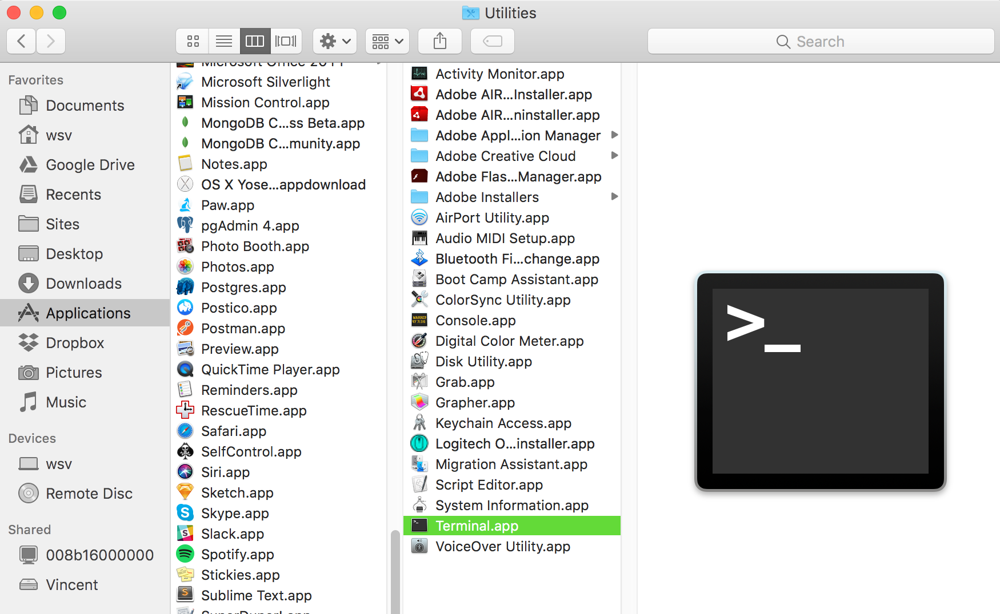
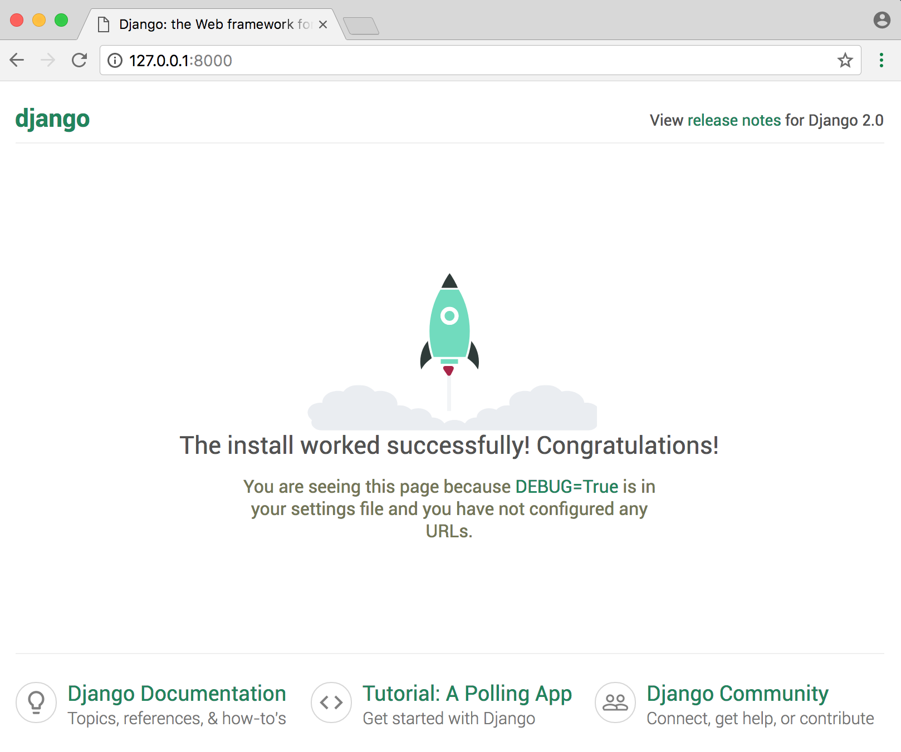

# Chapter 1: Initial Setup

This chapter covers how to properly configure your computer to work on Django projects. We start with an overview of the command line and use it to install the latest versions of both Django (2.0) and Python (3.6x). Then we discuss virtual environments, git, and working with a text editor.

By the end of this chapter you'll be ready to create and modify new Django projects in just a few keystrokes.

## The Command Line

The command line is a powerful, text-only view of your computer. As developers we will use it extensively throughout this book to install and configure each Django project.

On a Mac, the command line is found in a program called Terminal located at `/Applications/Utilities`. To find it, open a new Finder window, open the Applications folder, scroll down to open the Utilities folder, and double-click the application called Terminal.



On Windows, there is a built-in command line program but it is difficult to use. I recommend instead using [Babun](https://babun.github.io/), a free and open-source command line program.


Click on the “Download now” button on its website, double-click it to install Babun, and upon completion drag the installer to the Recycle Bin. To use Babun go to the Start menu, select Programs, and click on Babun.

Going forward when the book refers to the "command line" it means to open a new console on your computer using either Terminal or Babun.

While there are many possible commands we can use, in practice there are six used most frequently in Django development.

* `cd` (change down a directory)
* `cd ..` (change up a directory)
* `ls` (list files in your current directory)
* `pwd` (print working directory)
* `mkdir` (make directory)
* `touch` (create a new file)

Open your command line and try them out. The `$` dollar sign is our command line prompt: all commands in this book are intended to be typed **after** the `$` prompt.

For example, let's change into our Desktop directory.

```
$ cd ~/Desktop
```

Note that our current location `~/Desktop` is automatically added before our command line prompt. To confirm we're in the proper location we can use `pwd` which will print out the path of our current directory.

```
~/Desktop $ pwd
/Users/wsv/desktop
```

On my Mac computer this shows that I'm using the user `wsv` and on the `desktop` for that account.

Let's create a new directory folder with `mk_dir`, `cd` into it, and add a new file `index.html`.

```
~/Desktop $ mkdir new_folder
~/Desktop $ cd new_folder
~/Desktop/new_folder $ touch index.html
```

Now use `ls` to list all current files in our directory. You'll see there's just the newly created `index.html`.

```
~/Desktop/new_folder $ ls
index.html
```

As a final step return to the Desktop directory with `cd ..` and use `pwd` to confirm the location.

```
~/Desktop/new_folder $ cd ..
~/Desktop $ pwd
/Users/wsv/desktop
```

Advanced developers can use their keyboard and command line to navigate through their computer with ease; with practice this approach is much faster than using a mouse.

In this book I'll give you the exact instructions to run--you don't need to be an expert on the command line--but over time it's a good skill to have for any professional software developer. Two good free resources for further study are the [Command Line Crash Course](https://learnpythonthehardway.org/book/appendixa.html) and [CodeCademy’s Course on the Command Line](https://www.codecademy.com/learn/learn-the-command-line).

## Install Python 3 on Mac OS X ([click here for Windows](#install-python-3-on-windows) or [Linux](#install-python-3-on-linux))

Although Python 2 is installed by default on Mac computers, Python 3 is not. You can confirm this by typing `python --version` in the command line console and hitting Enter:

```
$ python --version
Python 2.7.13
```

To check if Python 3 is already installed try running the same command using `python3` instead of `python`.

```
$ python3 --version
```

If your computer outputs `3.6.x` (any version of 3.6 or higher) then skip ahead to [creating a virtual environment](#create-a-virtual-environment).
However most likely you'll see an error message since we need to install Python 3 directly.

Our first step is to install Apple's [Xcode](https://developer.apple.com/xcode/) package, so run the following command to install it:

```
$ xcode-select --install
```

Click through all the confirmation commands (Xcode is a large program so this might take a while to install depending on your internet connection).

Next, install the package manager [Homebrew](https://brew.sh/) via the longish command below:

```
$ /usr/bin/ruby -e "$(curl -fsSL https://raw.githubusercontent.com/Homebrew/install/master/install)"
```

To confirm Homebrew installed correctly, run this command:

```
$ brew doctor
Your system is ready to brew.
```

And now to install the latest version of Python, run the following command:

```
$ brew install python3
```

Now let's confirm which version was installed:

```
$ python3 --version
Python 3.6.4
```

To open a Python 3 interactive shell--this lets us run Python commands directly on our computer--simply type `python3` from the command line:

```
$ python3
Python 3.6.4 (default, Jan  7 2018, 13:05:00)
[GCC 4.2.1 Compatible Apple LLVM 9.0.0 (clang-900.0.39.2)] on darwin
Type "help", "copyright", "credits" or "license" for more information.
>>>
```

To exit the Python 3 interactive shell at any time type `Control-d` (the "Control" and "d" key at the same time).

You can still run Python shells with Python 2 by simply typing `python`:

```
$ python
Python 2.7.13 (default, Dec 18 2016, 07:03:39)
[GCC 4.2.1 Compatible Apple LLVM 8.0.0 (clang-800.0.42.1)] on darwin
Type "help", "copyright", "credits" or "license" for more information.
```

## Install Python 3 on Windows

Python is not included by default on Windows, however we can check if any version exists on the system. Open a command-line console by entering `command` on the Start Menu. Or you can hold down the SHIFT key and right-click on your desktop, then select **Open Command Window Here.**

Type the following command and hit RETURN:

```
python --version
Python 3.6.4
```

If you see output like this, Python is already installed. _Most likely it will not be!_

To download Python 3, go to the [downloads section](https://www.python.org/downloads/) of the official Python website. Download the installer and make sure to click the _Add Python to PATH_ option, which will let use use `python` directly from the command-line. Otherwise we'd have to enter our system's full path and modify our environment variables manually.

After Python has installed, run the following command in a new command-line console:

```
python --version
Python 3.6.4
```

If it works, you're done!

## Install Python 3 on Linux

Adding Python 3 to a Linux distribution takes a bit more work. Here are recommended recent guides [for Centos](https://danieleriksson.net/2017/02/08/how-to-install-latest-python-on-centos/)
and [for Debian](https://solarianprogrammer.com/2017/06/30/building-python-ubuntu-wsl-debian/). If you need additional help adding Python to your PATH please refer to [this Stack Overflow answer](https://stackoverflow.com/questions/14637979/how-to-permanently-set-path-on-linux-unix/14638025#14638025).

## Virtual Environments

[Virtual environments](https://en.wikipedia.org/wiki/Virtual_environment_software) are an indispensable part of Python programming. They are an isolated container containing all the software dependencies for a given project. This is important because by default software like Python and Django is installed _in the same directory_. This causes a problem when you want to work on multiple projects on the same computer. What if _ProjectA_ uses Django 2.0 but _ProjectB_ from last year is still on Django 1.10? Without virtual environments this becomes very difficult; with virtual environments it's no problem at all.

There are many areas of software development that are hotly debated, but using virtual environments for Python development is not one. **You should use a dedicated virtual environment for each new Python project**.

Historically Python developers have used either `virtualenv` or `pyenv` to configure virtual environments. But in 2017 prominent Python developer Kenneth Reitz released [Pipenv](https://docs.pipenv.org/) which is now [the officially recommended Python packaging tool](https://packaging.python.org/tutorials/managing-dependencies/#managing-dependencies).

Pipenv is similar to `npm` and `yarn` from the Node ecosystem: it creates a `Pipfile` containing software dependencies and a `Pipfile.lock` for ensuring deterministic builds. "Determinism" means that each and every time you download the software in a new virtual environment, you will have _exactly the same configuration_. Sebastian McKenzie, the creator of [Yarn](https://yarnpkg.com/en/) which first introduced this concept to JavaScript packaging, has a concise blog post [explaining what determinism is and why it matters](https://yarnpkg.com/blog/2017/05/31/determinism/).

The end result is that we will create a new virtual environment with `Pipenv` for each new Django Project.

To install `Pipenv` we can use `pip3` which Homebrew automatically installed for us alongside Python 3.

```
$ pip3 install pipenv
```

## Install Django

To see `Pipenv` in action, let's create a new directory and install Django. First navigate to the Desktop, create a new directory `django`, and enter it with `cd`.

```
$ cd ~/Desktop
$ mkdir django
$ cd django
```

Now use Pipenv to install Django.

```
$ pipenv install django
```

If you look within our directory there are now two new files: `Pipfile` and `Pipfile.lock`. We have the information we need for a new virtual environment but we have not activated it yet. Let's do that with `pipenv shell`.

```
$ pipenv shell
```

If successful you'll see parentheses on your command line with the environment activated. It will take the format of the directory name and random characters. On my computer, I see the below but you will see something slightly different.

```
(django-JmZ1NTQw) $
```

This means it's working! Create a new Django project called `test` with the following command. Don't forget that period `.` at the end which will create the project in the **current directory**. If you don't explicitly specify the location Django will create a directory **before** your Django directory.

```
(django-JmZ1NTQw) $ django-admin startproject test_project .
```

Now let's confirm everything is working by running Django's local web server.

```
(django-JmZ1NTQw) $ python manage.py runserver
```

If you visit [http://127.0.0.1:8000/](http://127.0.0.1:8000/) you should see the following image:



To stop our local server type `Control-c`. Then exit our virtual environment using the command `exit`.

```
(django-JmZ1NTQw) $ exit
```

We can always reactivate the virtual environment again using `pipenv shell` at any time.

We'll get lots of practice with virtual environments in this book so don't worry if it's a little confusing right now. The basic pattern is to install new packages with `pipenv`, activate them with `pipenv shell`, and then exit when done with `exit`.

It's worth noting that only one virtual environment can be active in a command line tab at a time. In future chapters we will be creating a brand new virtual environment for each new project. Either make sure to `exit` your current environment or open up a new tab for new projects.

## Install Git

[Git](https://Git-scm.com/) is an indispensable part of modern software development. It is a [version control system](https://en.wikipedia.org/wiki/Version_control) which can be thought of as an extremely powerful version of _track changes_ in Microsoft Word or Google Docs. With git, you can collaborate with other developers, track all your work via commits, and even revert to any previous version of your code even if you accidentally delete something important!

On a Mac, because Homebrew is already installed we can simply type `brew install git` on the command line:

```
$ brew install git
```

On Windows you should download Git from [Git for Windows](https://Git-for-windows.Github.io/). Click the "Download" button and follow the prompts for installation. Hit "next" on all steps except the fifth one, "Adjusting your PATH environment." Instead choose the bottom option: "Use Git and optional Unix tools from the Windows Command Prompt."

Once installed, we need to do a one-time _system_ setup to configure it by declaring the name and email address you want associated with all your Git commits (more on this shortly).

Within the command line console type the following two lines. Make sure to update them so that `Your Name` is...your name, and replace `your.email.address@example.com` with your real email address.

```
$ git config --global user.name "Your Name"
$ git config --global user.email your.email.address@example.com
```

You can always change these configs later if you desire by retyping the same commands with a new name or email address.

## Text Editors

The final step is our text editor. While the command line is where we execute commands for our programs, a text editor is where the actual code is written. The computer doesn't care what text editor you use--the end result is just code--but a good text editor can provide helpful hints and catch typos for you.

Experienced developers often prefer using either [Vim](<https://en.wikipedia.org/wiki/Vim_(text_editor)>) or [Emacs](https://en.wikipedia.org/wiki/Emacs), both decades-old, text-only editors with loyal followings. However each has a steep learning curve and requires memorizing many different keystroke combinations. I don't recommend them for newcomers.

Modern text editors combine the same powerful features with an appealing visual interface. My current favorite is [Visual Studio Code](https://code.visualstudio.com/) which is free, easy to install, and enjoys widespread popularity. If you're not already using a text editor, download and install [Visual Studio Code](https://code.visualstudio.com/) now.

## Conclusion

Phew! Nobody really likes configuring a local development environment but fortunately it's a one-time pain. We have now learned how to work with virtual environments and installed the latest version of Python and git. Everything is ready for our first Django app.
