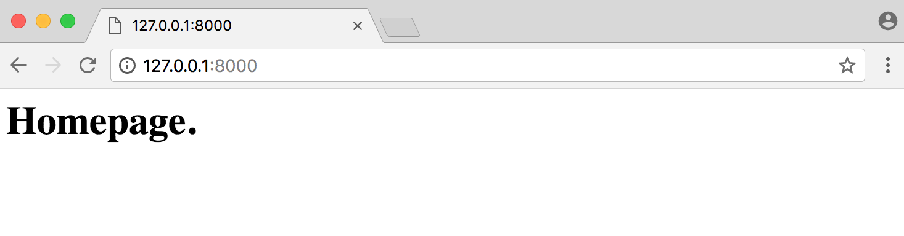
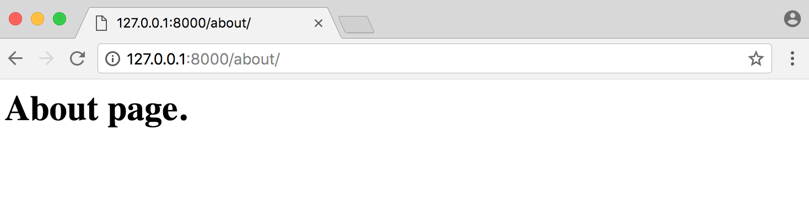
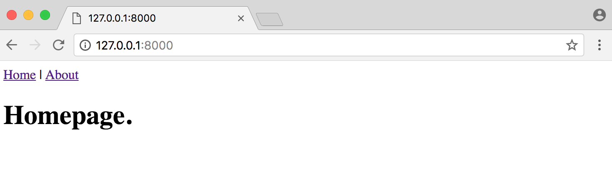
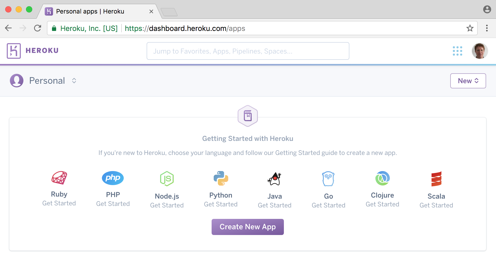
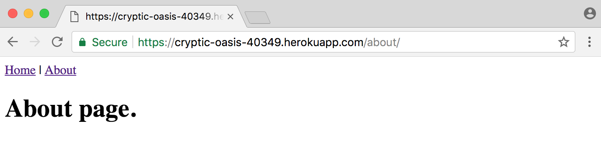

# Chapter 3: Pages app

In this chapter we'll build **and deploy** a *Pages* app that has a homepage and an about page. We'll also learn about Django's class-based views and templates which are the building blocks for the more complex web applications built later on in the book.

## Initial Setup

As in **Chapter 2: Hello World app**, our initial setup
involves the following steps:

* create a new directory for our code
* install Django in a new virtual environment
* create a new Django project
* create a new app `pages`
* update `settings.py`

Make sure you're not working in an existing virtual environment. You can tell if there's anything in parentheses before your command line prompt. If you are simply type `exit` to leave it.

We will again create a new directory `pages` for our project on the Desktop but you can put your code anywhere you like on your computer. It just needs to be in its own directory.

Within a new command line console start by typing the following:

{title="Command Line",lang="text"}
~~~~~~~~
$ cd ~/Desktop
$ mkdir pages
$ cd pages
$ pipenv install django
$ pipenv shell
(pages) $ django-admin startproject pages_project .
(pages) $ python manage.py startapp pages
~~~~~~~~

I'm using `(pages)` here to represent the virtual environment but in reality mine has the form of `(pages-unOYeQ9e)`. Your virtual environment name will be unique, too.

Open your text editor and navigate to the file `settings.py`. Add the `pages` app to our project under `INSTALLED_APPS`:

{title="Code",lang="python"}
~~~~~~~~
# pages_project/settings.py
INSTALLED_APPS = [
    'django.contrib.admin',
    'django.contrib.auth',
    'django.contrib.contenttypes',
    'django.contrib.sessions',
    'django.contrib.messages',
    'django.contrib.staticfiles',
    'pages',
]
~~~~~~~~

Start the local web server with `runserver`.

{title="Command Line",lang="text"}
~~~~~~~~
(pages) $ python manage.py runserver
~~~~~~~~

And then navigate to [http://127.0.0.1:8000/](http://127.0.0.1:8000/).

## Templates

Every web framework needs a convenient way to generate HTML files. In Django, the approach is to use templates so that individual HTML files can be served by a view to a webpage specified by the URL.

The question of where to place the templates directory can be confusing for beginners. By default, Django looks within each app for templates. So if we had a template called `home.html` in our `pages` app, Django expects it to be located at `pages/templates/pages/home.html`.

If we later created a second app called `blog` and wanted to add a `blog_list.html` file, Django would expect it to be located at `blog/templates/blog/blog_list.html`. In other words, within the existing app, in a folder called `templates`, then in *another* directory with the app name. This is confusing the first few times you hear it!

Another approach often used is to instead place all templates in a single, project-level directory called `templates`. This is the approach we'll use since I prefer to have all my templates in one place. By updating our `settings.py` file we can tell Django to **also** look for a `templates` folder, not just within each app for templates.

First quit our server with `Control-c`. Then create a project-level folder called `templates` and an HTML file called `home.html`.

{title="Command Line",lang="text"}
~~~~~~~~
(pages) $ mkdir templates
(pages) $ touch templates/home.html
~~~~~~~~

Next we need to update `settings.py` to tell Django to look at the project-level for templates. This is a one-line change to the setting `'DIRS'` under `TEMPLATES`.

{title="Code",lang="python"}
~~~~~~~~
# pages_project/settings.py
TEMPLATES = [
    {
        ...
        'DIRS': [os.path.join(BASE_DIR, 'templates')],
        ...
    },
]
~~~~~~~~

Then we can add a simple headline to our `home.html` file.

{title="Code",lang="html"}
~~~~~~~~
<!-- templates/home.html -->
<h1>Homepage.</h1>
~~~~~~~~

Ok, our template is complete! The next step is to configure our url and view.

## Class-Based Views

Early versions of Django only shipped with function-based views, but developers soon found themselves repeating the same patterns over and over again. Write a view that lists all objects in a model. Write a view that displays only one detailed item from a model. And so on.

Function-based generic views were introduced to abstract these patterns and streamline development of common patterns. However there was [no easy way to extend or customize these views](https://docs.djangoproject.com/en/2.0/topics/class-based-views/intro/). As a result, Django introduced class-based generic views that make it easy to use and also extend views covering common use cases.

Classes are a fundamental part of Python but a thorough discussion of them is beyond the scope of this book. If you need an introduction or refresher, I suggest reviewing the [official Python docs](https://docs.python.org/3.6/tutorial/classes.html) which has an excellent tutorial on classes.

We'll use the [built-in TemplateView](https://docs.djangoproject.com/en/2.0/ref/class-based-views/base/#django.views.generic.base.TemplateView) to display our template in the `pages/views.py` file.

{title="Code",lang="python"}
~~~~~~~~
# pages/views.py
from django.views.generic import TemplateView

class HomePageView(TemplateView):
    template_name = 'home.html'
~~~~~~~~

Note that we've capitalized our view now since it's a Python class. The `TemplateView` already contains all the logic needed to display our template, we just need to specify its name.

## URLs

The last step is to update our URLConfs. Recall from Chapter 2 that we need to make updates in two locations. First we update the project-level `urls.py` file to point at our `pages` app and then within `pages` we match the views to routes.

Let's start with the project-level `urls.py` file.

{title="Code",lang="python"}
~~~~~~~~
# pages_project/urls.py
from django.contrib import admin
from django.urls import path, include

urlpatterns = [
    path('admin/', admin.site.urls),
    path('', include('pages.urls')),
]
~~~~~~~~

Next create an app-level `urls.py` file.

{title="Command Line",lang="text"}
~~~~~~~~
(pages) $ touch pages/urls.py
~~~~~~~~

And add the following code.

{title="Code",lang="python"}
~~~~~~~~
# pages/urls.py
from django.urls import path

from . import views

urlpatterns = [
    path('', views.HomePageView.as_view(), name='home'),
]
~~~~~~~~

This pattern is almost identical to what we did in Chapter 2 with one major difference. When using Class-Based Views, you always add `as_view()` at the end.

And we're done! If you start up the web server with `python manage.py runserver` and navigate to [http://127.0.0.1:8000/](http://127.0.0.1:8000/) you can see our new homepage.

## Add an About Page

The process for adding an about page is **very** similar to what we just did. We'll create a new template file, a new view, and a new url route.

Quit the server `Control-c` and create a new template called `about.html`.

{title="Command Line",lang="text"}
~~~~~~~~
(pages) $ touch templates/about.html
~~~~~~~~

Then populate it with a short HTML headline.

{title="Code",lang="html"}
~~~~~~~~
<!-- templates/about.html -->
<h1>About page.</h1>
~~~~~~~~

Create a new view for the page.

{title="Code",lang="python"}
~~~~~~~~
# pages/views.py
from django.views.generic import TemplateView

class HomePageView(TemplateView):
    template_name = 'home.html'

class AboutPageView(TemplateView):
    template_name = 'about.html'
~~~~~~~~

And then connect it to a url at `about/`.

{title="Code",lang="python"}
~~~~~~~~
# pages/urls.py
from django.urls import path

from . import views

urlpatterns = [
    path('', views.HomePageView.as_view(), name='home'),
    path('about/', views.AboutPageView.as_view(), name='about'),
]
~~~~~~~~

Start up the web server with `python manage.py runserver`.

Navigate to [http://127.0.0.1:8000/about](http://127.0.0.1:8000/about) and you can see our new "About page".

## Extending Templates

The real power in templates is their ability to be extended. If you think about most web sites, there is content that is repeated on every page (header, footer, etc). Wouldn't it be nice if we, as developers, could have _one canonical place_ for our header code that would be inherited by all other templates?

Well we can! Let's create a `base.html` file containing a header with links to our two pages. First `Control-c` and then type the following.

{title="Command Line",lang="text"}
~~~~~~~~
(pages) $ touch templates/base.html
~~~~~~~~

Django has a minimal templating language for adding links and basic logic in our templates. To add links we can use the [built-in url tag](https://docs.djangoproject.com/en/2.0/ref/templates/builtins/#url). Remember how we added optional URL names to our url routers? This is why. The `url` tag uses these names to automatically create links for us.

{title="Code",lang="html"}
~~~~~~~~
<!-- pages/base.html -->
<header>
  <a href="">Home</a> | <a href="">About</a>
</header>



~~~~~~~~

At the bottom we've added a `block` tag called `content`. Blocks can be overwritten by child templates via inheritance.

Let's update our `home.html` and `about.html` to extend the `base.html` template.

{title="Code",lang="html"}
~~~~~~~~
<!-- templates/home.html -->



<h1>Homepage.</h1>

~~~~~~~~

{title="Code",lang="html"}
~~~~~~~~
<!-- templates/about.html -->



<h1>About page.</h1>

~~~~~~~~

Now if you start up the server with `python manage.py runserver` and open up our webpages again at
[http://127.0.0.1:8000/](http://127.0.0.1:8000/) and [http://127.0.0.1:8000/about](http://127.0.0.1:8000/about) you'll
see the header is magically included in _both_ locations.

Nice, right?

There's _a lot_ more we can do with templates and in practice you'll typically create a `base.html` file and then add
additional templates on top of it in a robust Django project. We'll do this later on in the book.

## Tests

Finally we come to tests. Even in an application this basic, it's important to add tests and get in the habit of always
adding them to our Django projects. In the words of [Jacob Kaplan-Moss](https://jacobian.org/), one of Django's original
creators, "Code without tests is broken as designed."

Fortunately Django comes with robust, built-in
[testing tools](https://docs.djangoproject.com/en/2.0/topics/testing/overview/) that make writing and running tests
easier.

If you look within our `pages` app, Django already provided a `tests.py` file we can use. Open it and add the
following code:

{title="Code",lang="python"}
~~~~~~~~
# pages/tests.py
from django.test import SimpleTestCase

class SimpleTests(SimpleTestCase):
    def test_home_page_status_code(self):
        response = self.client.get('/')
        self.assertEqual(response.status_code, 200)

    def test_about_page_status_code(self):
        response = self.client.get('/about/')
        self.assertEqual(response.status_code, 200)
~~~~~~~~

We're using [SimpleTestCase](https://docs.djangoproject.com/en/2.0/topics/testing/tools/#django.test.SimpleTestCase)
here since we aren't using a database. If we were using a database, we'd instead use
[TestCase](https://docs.djangoproject.com/en/2.0/topics/testing/tools/#django.test.TestCase). Then we perform a
check if the status code for each page is 200, which is the
[standard response for a successful HTTP request](https://en.wikipedia.org/wiki/List_of_HTTP_status_codes).

To run the tests quit the server `Control-c` and type `python manage.py test` on the command line:

{title="Command Line",lang="text"}
~~~~~~~~
(pages) $ python manage.py test
Creating test database for alias 'default'...
..
----------------------------------------------------------------------
Ran 2 tests in 0.028s

OK
Destroying test database for alias 'default'...
~~~~~~~~

Success! We'll do much more with testing in the future, especially once we start working with databases. For now, it's
important to see how easy it is to add tests each and every time we add new functionality to our Django project.

## Git and Bitbucket

It's time to track our changes with _git_ and push them up to Bitbucket. We'll start by initializing our directory.

{title="Command Line",lang="text"}
~~~~~~~~
(pages) $ git init
~~~~~~~~

Use `git status` to see all our code changes then `git add -A` to add them all. Finally we'll add our first commit message.

{title="Command Line",lang="text"}
~~~~~~~~
(pages) $ git status
(pages) $ git add -A
(pages) $ git commit -m 'initial commit'
~~~~~~~~

Over on Bitbucket [create a new repo](https://bitbucket.org/repo/create) which we'll call `pages-app`.

On the next page click on the bottom link for "I have an existing project". Copy the two commands to connect and then push the repository to Bitbucket.

It should look like this, replacing `wsvincent` with your Bitbucket username:

{title="Command Line",lang="text"}
~~~~~~~~
(pages) $ git remote add origin git@bitbucket.org:wsvincent/pages-app.git
(pages) $ git push -u origin master
~~~~~~~~

## Local vs Production

Up to this point we've been using Django's own internal web server to power our *Pages* application locally on our computer. But you can't share a localhost address with someone else. To make our site available on the Internet where everyone can see it, we need to deploy our code to an external server that anyone can use to see our site. This is called putting our code into _production_. Local code lives only on our computer; production code lives on an external server.

There are many server providers available but we will use [Heroku](https://www.heroku.com/) because it is free for small projects, widely-used, and has a relatively straightforward deployment process.

## Heroku

You can sign up for a free [Heroku](https://www.heroku.com/) on their website. After you confirm your email Heroku will redirect you to the dashboard section of the site.

Now we need to install Heroku's _Command Line Interface (CLI)_ so we can deploy from the command line. We want to install Heroku globally so it is available across our entire computer, so open up a new command line tab (Control + t). If we installed Heroku within our virtual environment, it would only be available there.

Within this new tab, on a Mac use Homebrew to install Heroku:

{title="Command Line",lang="text"}
~~~~~~~~
$ brew install heroku
~~~~~~~~

On Windows, see the [Heroku CLI page](https://devcenter.heroku.com/articles/heroku-cli#download-and-install) to correctly install either the 32-bit or 64-bit version.

Once installation is complete you can close our new command line tab and return to the initial tab with the `pages` virtual environment active.

Type the command `heroku login` and use the email and password for Heroku you just set.

{title="Command Line",lang="text"}
~~~~~~~~
(pages) $ heroku login
Enter your Heroku credentials:
Email: will@wsvincent.com
Password: *********************************
Logged in as will@wsvincent.com
~~~~~~~~

## Additional Files

We need to make the following changes to our _Pages_ project so it's ready to deploy online with Heroku:

* update `Pipfile.lock`
* new `Procfile` file
* install `gunicorn`
* one-line change to `settings.py` file

Within your `Pipfile` specify the version of Python we're using, which is `3.6`. Add these two lines at the bottom of the file.

{title="Code",lang="python"}
~~~~~~~~
# Pipfile
[requires]
python_version = "3.6"
~~~~~~~~

Then run `pipenv lock` to generate the appropriate `Pipfile.lock`.

{title="Command Line",lang="text"}
~~~~~~~~
(pages) $ pipenv lock
~~~~~~~~

Heroku actually looks in our `Pipfile.lock` for information on our virtual environment, which is why we add the language setting here.

Then create a `Procfile` which is specific to Heroku.

{title="Command Line",lang="text"}
~~~~~~~~
(pages) $ touch Procfile
~~~~~~~~

Open `Procfile` with your text editor and add the following:

{title="Code",lang="text"}
~~~~~~~~
web: gunicorn pages_project.wsgi --log-file -
~~~~~~~~

Now we need to install [gunicorn](http://gunicorn.org/) which is a web server suitable for production. We'll continue to use Django's local server on our computer but will use gunicorn on Heroku.

{title="Command Line",lang="text"}
~~~~~~~~
(pages) $ pipenv install gunicorn
~~~~~~~~

The final step is a one-line change to `settings.py`. Scroll down to the section called `ALLOWED_HOSTS` and add a `'*'` so it looks as follows:

{title="Code",lang="python"}
~~~~~~~~
# pages_project/settings.py
ALLOWED_HOSTS = ['*']
~~~~~~~~

And we're done!

Use `git status` to check our changes, add the new files, and then commit them:

{title="Command Line",lang="text"}
~~~~~~~~
(pages) $ git status
(pages) $ git add -A
(pages) $ git commit -m "New updates for Heroku deployment"
~~~~~~~~

And push to Bitbucket so we have an online backup:

{title="Command Line",lang="text"}
~~~~~~~~
(pages) $ git push -u origin master
~~~~~~~~

## Deploy

The last step is to actually deploy with Heroku. If you've ever configured a server yourself for deployments, you'll be amazed at how much simpler the process is with platform-as-a-service providers like Heroku.

Our process will be as follows:

* create a new app on Heroku and push our code to it
* add a git remote "hook" for Heroku
* configure it to ignore static files, which we'll cover in later chapters
* start the Heroku server so the app is live
* visit the app on Heroku's provided URL

We can do the first step, creating a new Heroku app, from the command line with `heroku create`. Heroku will create a random name for our app, in my case `cryptic-oasis-40349`. Your name will be different.

{title="Command Line",lang="text"}
~~~~~~~~
(pages) $ heroku create
Creating app... done, ⬢ cryptic-oasis-40349
https://cryptic-oasis-40349.herokuapp.com/ | https://git.heroku.com/cryptic-oasis-40349.git
~~~~~~~~

Now we need to add a "hook" for Heroku within git. This means that git will store both our settings for pushing code to Bitbucket and to Heroku. My Heroku app is called `cryptic-oasis-40349` so my command is as follows.

{title="Command Line",lang="text"}
~~~~~~~~
(pages) $ heroku git:remote -a cryptic-oasis-40349
~~~~~~~~

You should replace `cryptic-oasis-40349` with the app-name Heroku provides.

We only need to do one set of Heroku configurations at this point, which is to tell Heroku to ignore static files like CSS and JavaScript which Django by default tries to optimize for us. We'll cover this in later chapters so for now just run the following command.

{title="Command Line",lang="text"}
~~~~~~~~
(pages) $ heroku config:set DISABLE_COLLECTSTATIC=1
~~~~~~~~

Now we can push our code to Heroku. Because we set our "hook" previously, it will go to Heroku.

{title="Command Line",lang="text"}
~~~~~~~~
(pages) $ git push heroku master
~~~~~~~~

If we just typed `git push origin master` then the code is pushed to Bitbucket, not Heroku. Adding `heroku` to the command sends the code to Heroku. This is a little confusing the first few times.

Finally we need to make our Heroku app live. As websites grow in traffic they need additional Heroku services but for our basic example we can use the lowest level, `web=1`, which also happens to be free!

Type the following command.

{title="Command Line",lang="text"}
~~~~~~~~
(pages) $ heroku ps:scale web=1
~~~~~~~~

We're done! The last step is to confirm our app is live and online. If you use the command `heroku open` your web browser will open a new tab with the URL of your app:

{title="Command Line",lang="text"}
~~~~~~~~
(pages) $ heroku open
~~~~~~~~

Mine is at [https://cryptic-oasis-40349.herokuapp.com/about/](https://cryptic-oasis-40349.herokuapp.com/about/). You can see both the homepage and about page are up now.

## Conclusion

Congratulations on building and deploying your second Django project! This time we used templates, class-based views, explored
URLConfs more fully, added basic tests, and used Heroku! Next up we'll move on to our first database-backed project and see where Django really shines.
