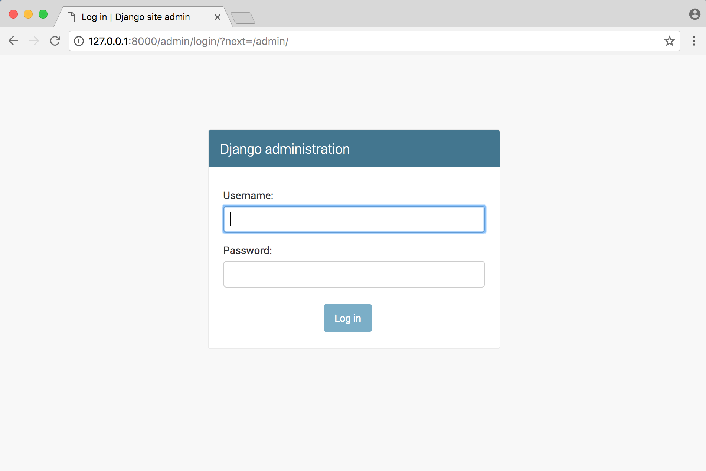
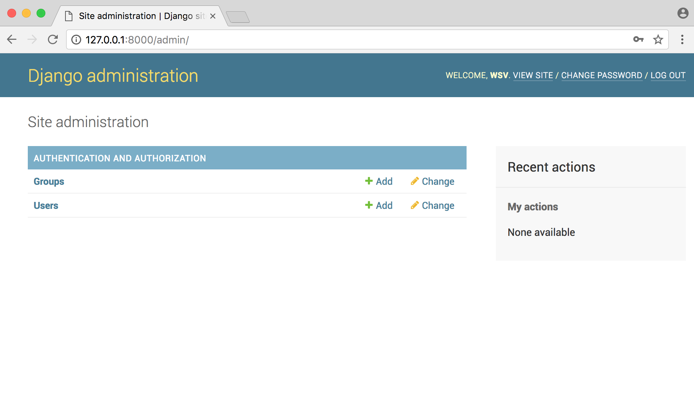
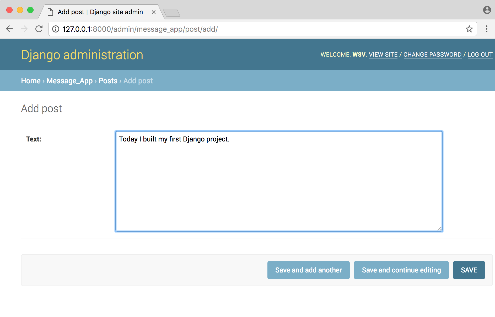
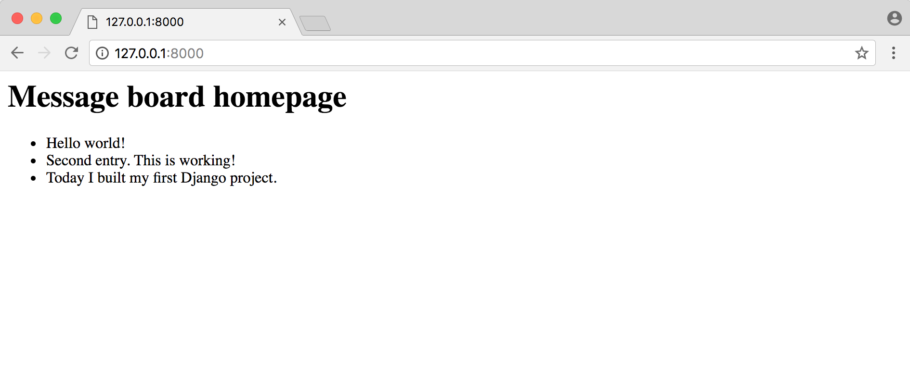

# Chapter 4: Message Board app

In this chapter we will use a database for the first time to build a basic *Message Board* application where users can post and read short messages. We'll explore Django's powerful built-in admin interface which provides a visual way to make changes to our data. And after adding tests we will push our code to Bitbucket and deploy the app on Heroku.

Django provides built-in support for several types of database backends. With just a few lines in our `settings.py` file it can support PostgreSQL, MySQL, Oracle, or SQLite. But the simplest--**by far**--to use is [SQLite](https://www.sqlite.org/) because it runs off a single file and requires no complex installation. By contrast, the other options require a process to be running in the background and can be quite complex to properly configure. Django uses SQLite by default for this reason and it's a perfect choice for small projects.

## Initial Setup
Since we've already set up several Django projects at this point in the book, we can quickly run through our commands to begin a new one. We need to do the following:

* create a new directory for our code on the Desktop called `mb`
* install Django in a new virtual environment
* create a new project called `mb_project`
* create a new app call `posts`
* update `settings.py`

In a new command line console, enter the following commands. Note that I'm using `(mb)` here to represent the virtual environment name even though it's actually `(mb-XXX)` where `XXX` represents random characters.

{title="Command Line",lang="text"}
~~~~~~~~
$ cd ~/Desktop
$ mkdir mb
$ cd mb
$ pipenv install django
$ pipenv shell
(mb) $ django-admin startproject mb_project .
(mb) $ python manage.py startapp posts
~~~~~~~~

Tell Django about the new app `posts` by adding it to the bottom of the `INSTALLED_APPS` section of our `settings.py` file. Open it with your text editor of choice.

{title="Code",lang="python"}
~~~~~~~~
# mb_project/settings.py
INSTALLED_APPS = [
    'django.contrib.admin',
    'django.contrib.auth',
    'django.contrib.contenttypes',
    'django.contrib.sessions',
    'django.contrib.messages',
    'django.contrib.staticfiles',
    'posts', # new
]
~~~~~~~~

Then execute the `migrate` command to create an initial database based on Django's default settings.

{title="Command Line",lang="text"}
~~~~~~~~
(mb) $ python manage.py migrate
~~~~~~~~

If you look inside our directory with the `ls` command, you'll see there's now a `db.sqlite3` file representing our [SQLite](https://www.sqlite.org/) database.

{title="Command Line",lang="text"}
~~~~~~~~
(mb) $ ls
db.sqlite3 mb_project manage.py
~~~~~~~~

**Aside**: Technically a `db.sqlite3` file is created the first time you run *either* `migrate` or `runserver`. Using `runserver` configures a database using Django's default settings, however `migrate` will sync the database with the current state of any database models contained in the project and listed in `INSTALLED_APPS`. In other words, to make sure the database reflects the current state of your project you'll need to run `migrate` (and also `makemigrations`) each time you update a model. More on this shortly.

To confirm everything works correctly, spin up our local server.

{title="Command Line",lang="text"}
~~~~~~~~
(mb) $ python manage.py runserver
~~~~~~~~

And navigate to [http://127.0.0.1:8000/](http://127.0.0.1:8000/) to see the familiar Django installed correctly page.

## Create a database model
Our first task is to create a database model where we can store and display posts from our users. Django will turn this model into a database table for us. In real-world Django projects, it's often the case that there will be many complex, interconnected database models but in our simple message board app we only need one.

I won't cover database design in this book but I have written a short guide which [you can find here](https://wsvincent.com/database-design-tutorial-for-beginners/") if this is all new to you.

Open the `posts/models.py` file and look at the default code which Django provides:

{title="Code",lang="python"}
~~~~~~~~
# posts/models.py
from django.db import models

# Create your models here
~~~~~~~~

Django imports a module `models` to help us build new database models, which will "model" the characteristics of the data in our database. We want to create a model to store the textual content of a message board post, which we can do so as follows:

{title="Code",lang="python"}
~~~~~~~~
# posts/models.py
from django.db import models

class Post(models.Model):
    text = models.TextField()
~~~~~~~~

Note that we've created a new database model called `Post` which has the database field `text`. We've also specified the *type of content* it will hold, `TextField()`. Django provides many [model fields](https://docs.djangoproject.com/en/2.0/ref/models/fields/) supporting common types of content such as characters, dates, integers, emails, and so on.

## Activating models
Now that our new model is created we need to activate it. Going forward, whenever we create or modify an existing model we'll need to update Django in a two-step process.

1. First we create a migration file with the `makemigrations` command which generate the SQL commands for preinstalled apps in our `INSTALLED_APPS` setting. Migration files **do not execute those commands** on our database file, rather they are a reference of all new changes to our models. This approach means that we have a record of the changes to our models over time.

2. Second we build the actual database with `migrate` which **does execute** the instructions in our migrations file.

{title="Command Line",lang="text"}
~~~~~~~~
(mb) $ python manage.py makemigrations posts
(mb) $ python manage.py migrate posts
~~~~~~~~

Note that you don't *have* to include a name after either `makemigrations` or `migrate`. If you simply run the commands then they will apply to all available changes. But it's a good habit to be specific. If we had two separate apps in our project, and updated the models in both, and then ran `makemigrations` it would generate a migrations file containing data on both changes. This makes debugging harder in the future. You want each migration file to be as small and isolated as possible. That way if you need to look at past migrations, there is only one change per migration rather than one that applies to multiple apps.

## Django Admin
Django provides us with a robust admin interface for interacting with our database. This is a truly killer feature that few web frameworks offer. It has its routes in [Django's origin as a project at a newspaper](https://docs.djangoproject.com/en/2.0/faq/general/). The developers wanted a CMS (Content Management System) so that journalists could write and edit their stories without needing to touch "code." Over time the built-in admin app has evolved into a fantastic, out-of-the-box tool for managing all aspects of a Django project.

To use the Django admin, we first need to create a `superuser` who can login. In your command line console, type `python manage.py createsuperuser` and respond to the prompts for a username, email, and password:

{title="Command Line",lang="text"}
~~~~~~~~
(mb) $ python manage.py createsuperuser
Username (leave blank to use 'wsv'): wsv
Email:
Password:
Password (again):
Superuser created successfully.
~~~~~~~~

**Note**: When you type your password, it will not appear visible in the command line console for security reasons.

Restart the Django server with `python manage.py runserver` and in your browser go to [http://127.0.0.1:8000/admin/](http://127.0.0.1:8000/admin/). You should see the admin’s login screen:

Login by entering the username and password you just created. You will see the Django admin homepage next:

But where's our `posts` app? It's not displayed on the main admin page!

We need to explicitly tell Django what to display in the admin. Fortunately we can change fix this easily by opening the `posts/admin.py` file and editing it to look like this:

{title="Code",lang="python"}
~~~~~~~~
# posts/admin.py
from django.contrib import admin

from .models import Post

admin.site.register(Post)
~~~~~~~~

Django now knows that it should display our `posts` app and its database model `Post` on the admin page. If you refresh your browser you'll see that it now appears:

Now let's create our first message board post for our database. Click on the `+ Add` button opposite `Posts`. Enter your own text in the `Text` form field.

Then click the "Save" button, which will redirect you to the main Post page. However if you look closely, there's a problem: our new entry is called "Post object", which isn't very helpful.

Let's change that. Within the `posts/models.py` file, add a new function `__str__` as follows:

{title="Code",lang="python"}
~~~~~~~~
# posts/models.py
from django.db import models

class Post(models.Model):
    text = models.TextField()

    def __str__(self):
        """A string representation of the model."""
        return self.text[:50]
~~~~~~~~

If you refresh your Admin page in the browser, you'll see it's changed to a much more descriptive and helpful representation of our database entry.

Much better! It's a best practice to add `str()` methods to all of your models to improve their readability.

## Views/Templates/URLs
In order to display our database content on our homepage, we have to wire up our views, templates, and URLConfs. This pattern should start to feel familiar now.

Let's begin with the view. Earlier in the book we used the built-in generic [TemplateView](https://docs.djangoproject.com/en/2.0/ref/class-based-views/base/#django.views.generic.base.TemplateView) to display a template file on our homepage. Now we want to list the contents of our database model. Fortunately this is also a common task in web development and Django comes equipped with the generic class-based  [ListView](https://docs.djangoproject.com/en/2.0/ref/class-based-views/generic-display/#listview).

In the `posts/views.py` file enter the Python code below:

{title="Code",lang="python"}
~~~~~~~~
# posts/views.py
from django.views.generic import ListView
from .models import Post

class HomePageView(ListView):
    model = Post
    template_name = 'home.html'
~~~~~~~~

In the first line we're importing `ListView` and in the second line we need to explicitly define which model we're using. In the view, we subclass `ListView`, specify our model name and specify our template reference. Internally `ListView` returns an object called `object_list` that we want to display in our template.

Our view is complete which means we still need to configure our URLs and make our template. Let's start with the template. Create a project-level directory called `templates` and a `home.html` template file.

{title="Command Line",lang="text"}
~~~~~~~~
(mb) $ mkdir templates
(mb) $ touch templates/home.html
~~~~~~~~

Then update the `DIRS` field in our `settings.py` file so that Django knows to look in this templates folder.

{title="Code",lang="python"}
~~~~~~~~
# settings.py
TEMPLATES = [
    {
        ...
        'DIRS': [os.path.join(BASE_DIR, 'templates')],
        ...
    },
]
~~~~~~~~

In our templates file `home.html` we can use the [Django Templating Language's](https://docs.djangoproject.com/en/2.0/ref/templates/language/) `for` loop to list all the objects in `object_list`. Remember that `object_list` is what `ListView` returns to us.

{title="Code",lang="html"}
~~~~~~~~
<!-- templates/home.html -->
<h1>Message board homepage</h1>
<ul>
  
    <li>{{ post }}</li>
  
</ul>
~~~~~~~~

The last step is to set up our URLConfs. Let's start with the project-level `urls.py` file where we simply include our `posts` and add `include` on the second line.

{title="Code",lang="python"}
~~~~~~~~
# mb_project/urls.py
from django.contrib import admin
from django.urls import path, include

urlpatterns = [
    path('admin/', admin.site.urls),
    path('', include('posts.urls')),
]
~~~~~~~~

Then create an app-level `urls.py` file.

{title="Command Line",lang="text"}
~~~~~~~~
(mb) $ touch posts/urls.py
~~~~~~~~

And update it like so:

{title="Code",lang="python"}
~~~~~~~~
# posts/urls.py
from django.urls import path

from . import views

urlpatterns = [
    path('', views.HomePageView.as_view(), name='home'),
]
~~~~~~~~

Restart the server with `python manage.py runserver` and navigate to our homepage [http://127.0.0.1:8000/](http://127.0.0.1:8000/) which now lists out our message board posts.

We're basically done at this point, but let's create a few more message board posts in the Django admin to confirm that they will display correctly on the homepage.

## Adding new posts
To add new posts to our message board, go back into the Admin:

[http://127.0.0.1:8000/admin/](http://127.0.0.1:8000/admin/)

And create two more posts. Here's what mine look like:

If you return to the homepage you'll see it automatically displays our formatted posts. Woohoo!

Everything works so it's a good time to initialize our directory, add the new code, and include our first `git` commit.

{title="Command Line",lang="text"}
~~~~~~~~
(mb) $ git init
(mb) $ git add -A
(mb) $ git commit -m 'initial commit'
~~~~~~~~

## Tests

Previously we were only testing static pages so we used [SimpleTestCase](https://docs.djangoproject.com/en/2.0/topics/testing/tools/#django.test.SimpleTestCase). But now that our homepage works with a database, we need to use [TestCase](https://docs.djangoproject.com/en/2.0/topics/testing/tools/#django.test.TestCase) which will let us create a "test" database we can check against. In other words, we don't need to run tests on our *actual* database but instead can make a separate test database, fill it with sample data, and then test against it.

Let's start by adding a sample post to the `text` database field and then check that it is stored correctly in the database. It's important that all our test methods start with `test_` so Django knows to test them! The code will look like this:

{title="Code",lang="python"}
~~~~~~~~
# posts/tests.py
from django.test import TestCase
from .models import Post

class PostModelTest(TestCase):

    def setUp(self):
        Post.objects.create(text='just a test')

    def test_text_content(self):
        post=Post.objects.get(id=1)
        expected_object_name = f'{post.text}'
        self.assertEqual(expected_object_name, 'just a test')
~~~~~~~~

At the top we import the `TestCase` module which lets us create a sample database, then import our `Post` model. We create a new class `PostModelTest` and add a method `setUp` to create a new database that has just one entry: a post with a text field containing the string 'just a test'.

Then we run our first test, `test_text_content`, to check that the database field actually contains `just a test`. We create a variable called `post` that represents the first `id` on our Post model. Remember that Django automatically sets this id for us. If we created another entry it would have an id of 2, the next one would be 3, and so on.

The following line uses [f strings](https://www.python.org/dev/peps/pep-0498/) which are a very cool addition to Python 3.6. They let us put variables directly in our strings as long as the variables are surrounded by brackets `{}`. Here we're setting `expected_object_name` to be the string of the value in `post.text`, which should be `just a test`.

On the final line we use `assertEqual` to check that our newly created entry does in fact match what we input at the top. Go ahead and run the test on the command line with `python manage.py test`.

{title="Command Line",lang="text"}
~~~~~~~~
(mb) $ python manage.py test
Creating test database for alias 'default'...
System check identified no issues (0 silenced).
.
----------------------------------------------------------------------
Ran 1 test in 0.001s

OK
Destroying test database for alias 'default'...
~~~~~~~~

It passed!

Don't worry if the previous explanation felt like information overload. That's natural the first time you start writing tests, but you'll soon find that most tests that you write are actually quite repetitive.

Time for our second test. The first test was on the model but now we want test our one and only page: the homepage. Specifically, we want to test that it exists (throws an HTTP 200 response), uses the `home` view, and uses the `home.html` template.

We'll need to add one more import at the top for `reverse` and a brand new class `HomePageViewTest` for our test.

{title="Code",lang="python"}
~~~~~~~~
from django.test import TestCase
from django.urls import reverse
from .models import Post

class PostModelTest(TestCase):

    def setUp(self):
        Post.objects.create(text='just a test')

    def test_text_content(self):
        post=Post.objects.get(id=1)
        expected_object_name = f'{post.text}'
        self.assertEqual(expected_object_name, 'just a test')

class HomePageViewTest(TestCase):

    def setUp(self):
        Post.objects.create(text='this is another test')

    def test_view_url_exists_at_proper_location(self):
        resp = self.client.get('/')
        self.assertEqual(resp.status_code, 200)

    def test_view_url_by_name(self):
        resp = self.client.get(reverse('home'))
        self.assertEqual(resp.status_code, 200)

    def test_view_uses_correct_template(self):
        resp = self.client.get(reverse('home'))
        self.assertEqual(resp.status_code, 200)
        self.assertTemplateUsed(resp, 'home.html')
~~~~~~~~

If you run our tests again you should see that they pass.

{title="Command Line",lang="text"}
~~~~~~~~
(mb) $ python manage.py test
Creating test database for alias 'default'...
System check identified no issues (0 silenced).
.
----------------------------------------------------------------------
Ran 4 tests in 0.036s

OK
Destroying test database for alias 'default'...
~~~~~~~~

Why does it say four tests? Remember that our `setUp` methods are not actually tests, they merely let us run subsequent tests. Our four actual tests are `test_text_content`, `test_view_url_exists_at_proper_location`, `test_view_url_by_name`, and `test_view_uses_correct_template`.

Any function that has the word `test*` at the beginning and exists in a `tests.py` file will be run when we execute the command `python manage.py test`.

We're done adding code for our testing so it's time to commit the changes to git.

{title="Command Line",lang="text"}
~~~~~~~~
(mb) $ git add -A
(mb) $ git commit -m 'added tests'
~~~~~~~~

## Bitbucket
We also need to store our code on Bitbucket. This is a good habit to get into in case anything happens to your local computer and it also allows you to share and collaborate with other developers.

You should already have a Bitbucket account from **Chapter 3** so go ahead and [create a new repo](https://bitbucket.org/repo/create) which we'll call `mb-app`.

On the next page click on the bottom link for “I have an existing project”. Copy the two commands to connect and then push the repository to Bitbucket.

It should look like this, replacing `wsvincent` (my username) with your Bitbucket username:

{title="Command Line",lang="text"}
~~~~~~~~
(mb) $ git remote add origin git@bitbucket.org:wsvincent/mb-app.git
(mb) $ git push -u origin master
~~~~~~~~

## Heroku configuration
You should also already have a Heroku account setup and installed from **Chapter 3**. We need to make the following changes to our *Message Board* project to deploy it online:

* update `Pipfile.lock`
* new `Procfile`
* install `gunicorn`
* update `settings.py`

Within your `Pipfile` specify the version of Python we're using, which is `3.6`. Add these two lines at the bottom of the file.

{title="Code",lang="python"}
~~~~~~~~
# Pipfile
[requires]
python_version = "3.6"
~~~~~~~~

Run `pipenv lock` to generate the appropriate `Pipfile.lock`.

{title="Command Line",lang="text"}
~~~~~~~~
(mb) $ pipenv lock
~~~~~~~~

Then create a `Procfile` which tells Heroku *how* to run the remote server where our code will live.

{title="Command Line",lang="text"}
~~~~~~~~
(mb) $ touch Procfile
~~~~~~~~

For now we're telling Heroku to use `gunicorn` as our production server and look in our `mb_project.wsgi` file for further instructions.

{title="Command Line",lang="text"}
~~~~~~~~
web: gunicorn mb_project.wsgi --log-file -
~~~~~~~~

Next install [gunicorn](http://gunicorn.org/) which we'll use in production while still using Django's internal server for local development use.

{title="Command Line",lang="text"}
~~~~~~~~
(mb) $ pipenv install gunicorn
~~~~~~~~

Finally update `ALLOWED_HOSTS` in our `settings.py` file.

{title="Code",lang="python"}
~~~~~~~~
# mb_project/settings.py
ALLOWED_HOSTS = ['*']
~~~~~~~~

We're all done! Add and commit our new changes to git and then push them up to Bitbucket.

{title="Command Line",lang="text"}
~~~~~~~~
(mb) $ git status
(mb) $ git add -A
(mb) $ git commit -m 'New updates for Heroku deployment'
(mb) $ git push -u origin master
~~~~~~~~

## Heroku deployment
Make sure you're logged into your correct Heroku account.

{title="Command Line",lang="text"}
~~~~~~~~
(mb) $ heroku login
~~~~~~~~

Then run the `create` command and Heroku will randomly generate an app name for you. You can customize this later if desired.

{title="Command Line",lang="text"}
~~~~~~~~
(mb) $ heroku create
Creating app... done, ⬢ agile-inlet-25811
https://agile-inlet-25811.herokuapp.com/ | https://git.heroku.com/agile-inlet-25811.git
~~~~~~~~

Set `git` to use the name of your new app when you push code to Heroku. My Heroku-generated name is `agile-inlet-25811` so the command looks like this.

{title="Command Line",lang="text"}
~~~~~~~~
(mb) $ heroku git:remote -a agile-inlet-25811
~~~~~~~~

Tell Heroku to ignore static files which we'll cover in-depth when deploying our *Blog* app later in the book.

{title="Command Line",lang="text"}
~~~~~~~~
(mb) $ heroku config:set DISABLE_COLLECTSTATIC=1
~~~~~~~~

Push the code to Heroku and add free scaling so it's actually running online, otherwise the code is just sitting there.

{title="Command Line",lang="text"}
~~~~~~~~
(mb) $ git push heroku master
(mb) $ heroku ps:scale web=1
~~~~~~~~

If you open the new project with `heroku open` it will automatically launch a new browser window with the URL of your app. Mine is live at:

[https://agile-inlet-25811.herokuapp.com/](https://agile-inlet-25811.herokuapp.com/).

## Conclusion
We've now built, tested, and deployed our first database-driven app. While it's deliberately quite basic, now we know how to create a database model, update it with the admin panel, and then display the contents on a webpage. But something is missing, no?

In the real-world, users need forms to interact with our site. After all, not everyone should have access to the admin panel. In the next chapter we'll build a blog application that uses forms so that users can create, edit, and delete posts. We'll also add styling via CSS.
