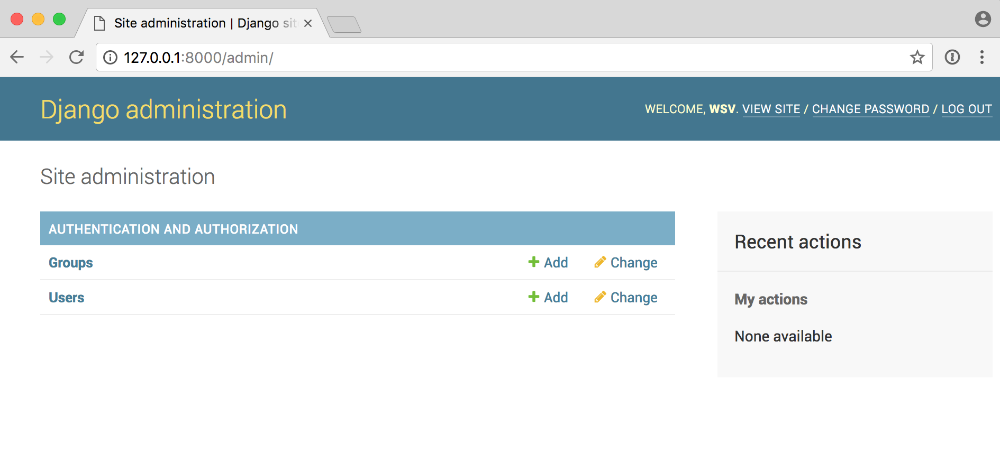
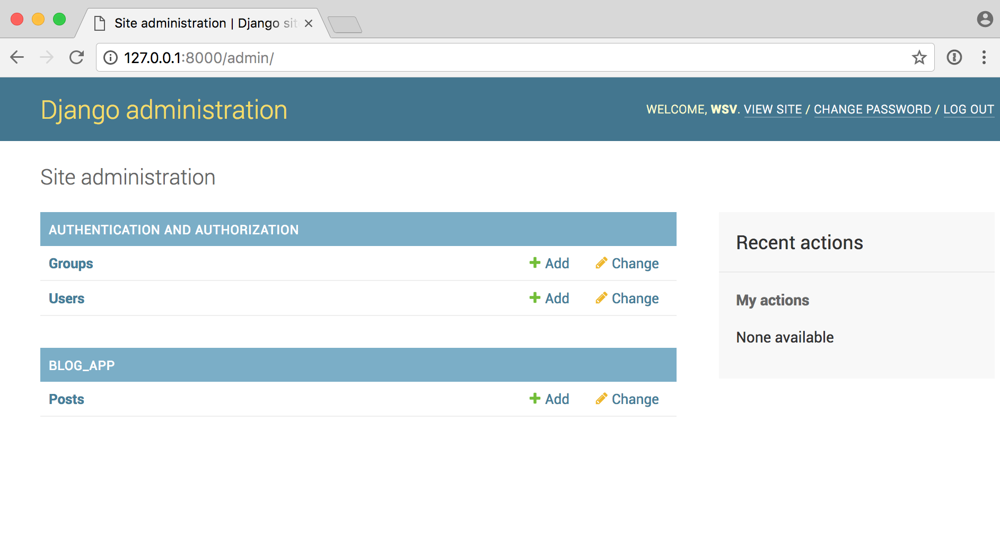
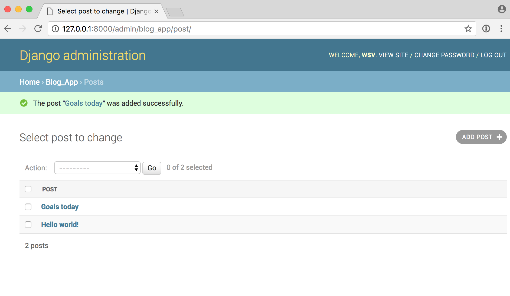
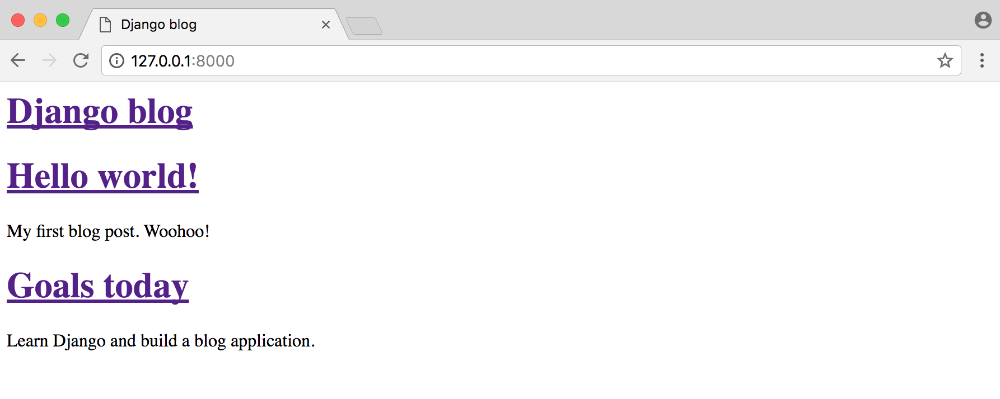
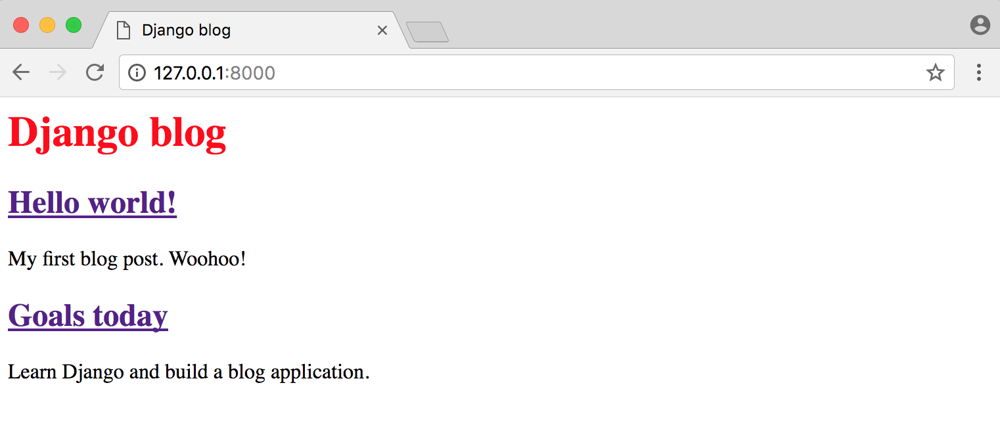
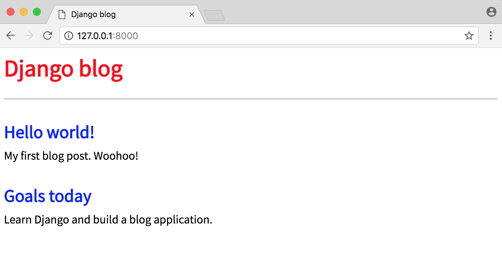
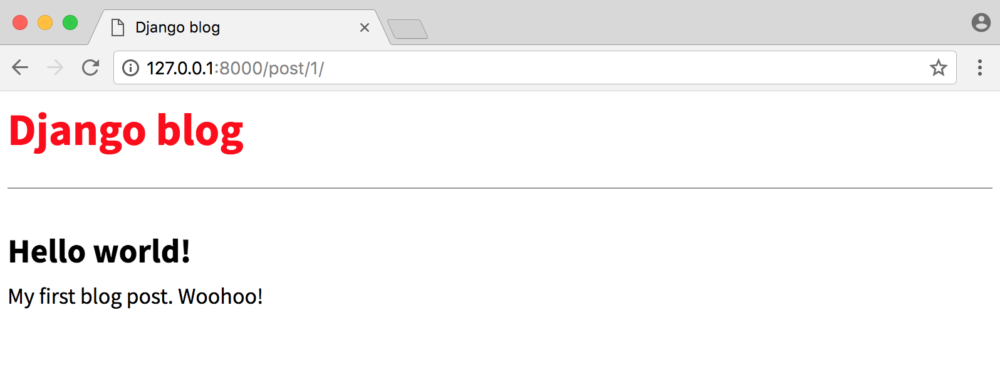

# Chapter 5: Blog app

In this chapter we'll build a basic _blog_ application that allows users to create, edit, and delete posts. The homepage will list all blog posts and there will be a dedicated detail page for each individual post. We'll also introduce CSS for styling and learn how Django works with static files.

## Initial Setup

As covered in previous chapters, our steps for setting up a new Django project are as follows:

* create a new directory for our code on the Desktop called `blog`
* install Django in a new virtual environment
* create a new Django project called `blog_project`
* create a new app `blog`
* perform a migration to set up the database
* update `settings.py`

Execute the following commands in a new command line console. Note that the actual name of the virtual environment will be `(blog-XXX)` where `XXX` represents random characters. I'm using `(blog)` here to keep things simpler since my name will differ from yours.

And don't forget to include the period `.` at the end of the command for creating our new `blog_project`.

{title="Command Line",lang="text"}
~~~~~~~~
$ cd ~/Desktop
$ mkdir blog
$ cd blog
$ pipenv install django
$ pipenv shell
(blog) $ django-admin startproject blog_project .
(blog) $ python manage.py startapp blog
(blog) $ python manage.py migrate
(blog) $ python manage.py runserver
~~~~~~~~

To ensure Django knows about our new app, open your text editor and add the new app to `INSTALLED_APPS` in our `settings.py` file:

{title="Code",lang="python"}
~~~~~~~~
# blog_project/settings.py
INSTALLED_APPS = [
    'django.contrib.admin',
    'django.contrib.auth',
    'django.contrib.contenttypes',
    'django.contrib.sessions',
    'django.contrib.messages',
    'django.contrib.staticfiles',
    'blog',
]
~~~~~~~~

If you navigate to [http://127.0.0.1:8000/](http://127.0.0.1:8000/) in your browser you should see the following page.

Ok, initial installation complete! Next we'll create our database model for blog posts.

## Database Models

What are the characteristics of a typical blog application? In our case let's keep things simple and assume each post has a title, author, and body. We can turn this into a database model by opening the `blog/models.py` file and entering the code below:

{title="Code",lang="python"}
~~~~~~~~
# blog/models.py
from django.db import models

class Post(models.Model):
    title = models.CharField(max_length=200)
    author = models.ForeignKey(
        'auth.User',
        on_delete=models.CASCADE,
    )
    body = models.TextField()

    def __str__(self):
        return self.title
~~~~~~~~

At the top we're importing the class `models` and then creating a subclass of `models.Model` called `Post`. Using this subclass functionality we automatically have access to everything within [django.db.models.Models](https://docs.djangoproject.com/en/2.0/topics/db/models/) and can add additional fields and methods as desired.

For `title` we're limiting the length to 200 characters and for `body` we're using a TextField which will automatically expand as needed to fit the user's text. There are many field types available in Django; you can see the [full list here](https://docs.djangoproject.com/en/2.0/topics/db/models/#fields).

For the `author` field we're using a [ForeignKey](https://docs.djangoproject.com/en/2.0/ref/models/fields/#django.db.models.ForeignKey) which allows for a _many-to-one_ relationship. This means that a given user can be the author of many different blog posts but not the other way around. The reference is to the built-in `User` model that Django provides for authentication. For all many-to-one relationships such as a ForeignKey we must also specify an [on_delete](https://docs.djangoproject.com/en/2.0/ref/models/fields/#django.db.models.ForeignKey.on_delete) option. Don't worry if this is confusing right now. Database design is a very deep field and we'll do much more with ForeignKey's in future chapters. I have a separate post on my personal site, [database design tutorial for beginners](https://wsvincent.com/database-design-tutorial-for-beginners/), that covers the topic in more depth.

Now that our new database model is created we need to create a new migration record for it and migrate the change into our database. This two-step process can be completed with the commands below:

{title="Command Line",lang="text"}
~~~~~~~~
(blog) $ python manage.py makemigrations blog
(blog) $ python manage.py migrate blog
~~~~~~~~

Our database is configured! What's next?

## Admin

We need a way to access our data. Enter the Django admin! First create a superuser account by typing the command below and following the prompts to set up an email and password. Note that when typing your password, it will not appear on the screen for security reasons.

{title="Command Line",lang="text"}
~~~~~~~~
(blog) $ python manage.py createsuperuser
Username (leave blank to use 'wsv'): wsv
Email:
Password:
Password (again):
Superuser created successfully.
~~~~~~~~

Now start running the Django server again with the command `python manage.py runserver` and open up the Django admin at [http://127.0.0.1:8000/admin/](http://127.0.0.1:8000/admin/). Login with your new superuser account.

Oops! Where's our new `Post` model?

We forgot to update `blog/admin.py` so let's do that now.

{title="Code",lang="python"}
~~~~~~~~
# blog/admin.py
from django.contrib import admin
from .models import Post

admin.site.register(Post)
~~~~~~~~

If you refresh the page you'll see the update.

Let's add two blog posts so we have some sample data to work with. Click on the `+ Add` button next to `Posts` to create a new entry. Make sure to add an "author" to each post too since by default all model fields are required. If you try to enter a post without an author you will see an error. If we wanted to change this, we could add [field options](https://docs.djangoproject.com/en/2.0/ref/models/fields/#field-options) to our model to make a given field optional or fill it with a default value.

Now that our database model is complete we need to create the necessary views, URLs, and templates so we can display the information on our web application.

## URLs

We want to display our blog posts on the homepage so, as in previous chapters, we'll first configure our project-level URLConfs and then our app-level URLConfs to achieve this.

On the command line quit the existing server with `Control-c` and create a new `urls.py` file within our `blog`:

{title="Command Line",lang="text"}
~~~~~~~~
(blog) $ touch blog/urls.py
~~~~~~~~

Now update it with the code below.

{title="Code",lang="python"}
~~~~~~~~
# blog/urls.py
from django.urls import path

from . import views

urlpatterns = [
    path('', views.BlogListView.as_view(), name='home'),
]
~~~~~~~~

We're importing our soon-to-be-created views at the top. The empty string `''` tells Python to match all values and we make it a named URL, `home`, which we can refer to in our views later on. While it's optional to add a [named URL](https://docs.djangoproject.com/en/2.0/topics/http/urls/#url-namespaces) it's a best practice you should adopt as it helps keep things organized as your number of URLs grows.

We also should update our project-level `urls.py` file so that it knows to forward all requests directly to the blog app.

{title="Code",lang="python"}
~~~~~~~~
# blog_project/urls.py
from django.contrib import admin
from django.urls import path, include

urlpatterns = [
    path('admin/', admin.site.urls),
    path('', include('blog.urls')),
]
~~~~~~~~

We've added `include` on the second line and a urlpattern using an empty string regular expression `''` indicating that URL requests should be redirected as is to `blog`'s URLs for further instructions.

## Views

We're going to use class-based views but if want to see a function-based way to build a blog application, I highly recommend the [Django Girls Tutorial](https://tutorial.djangogirls.org/en/).

In our views file, add the code below to display the contents of our `Post` model using `ListView`.

{title="Code",lang="python"}
~~~~~~~~
# blog/views.py
from django.views.generic import ListView

from . models import Post

class BlogListView(ListView):
    model = Post
    template_name = 'home.html'
~~~~~~~~

On the top two lines we import [ListView](https://docs.djangoproject.com/en/2.0/ref/class-based-views/generic-display/#listview) and our database model `Post`. Then we subclass `ListView` and add links to our model and template. This saves us a lot of code versus implementing it all from scratch.

## Templates

With our URLConfs and Views now complete, we're only missing the third piece of the puzzle: templates! As we already saw in **Chapter 4: Message board app**, we can inherit from other templates to keep our code clean. Thus we'll start off with a `base.html` file and a `home.html` file that inherits from it. Then later when we add templates for creating and editing blog posts, they too can inherit from `base.html`.

Start by creating our project-level `templates` directory with the two template files.

{title="Command Line",lang="text"}
~~~~~~~~
(blog) $ mkdir templates
(blog) $ touch templates/base.html
(blog) $ touch templates/home.html
~~~~~~~~

Then update `settings.py` so Django knows to look there for our templates.

{title="Code",lang="python"}
~~~~~~~~
# blog_project/settings.py
TEMPLATES = [
    {
        ...
        'DIRS': [os.path.join(BASE_DIR, 'templates')],
        ...
    },
]
~~~~~~~~

Update the `base.html` template as follows.

{title="Code",lang="html"}
~~~~~~~~
<!-- templates/base.html -->
<html>
  <head>
    <title>Django blog</title>
  </head>
  <body>
    <header>
      <h1><a href="/">Django blog</a></h1>
    </header>
    

      
      
    

  </body>
</html>
~~~~~~~~

Note that code between `` and
`` can be filled by other templates. Speaking of which, here is the code for `home.html`.

{title="Code",lang="html"}
~~~~~~~~
<!-- templates/home.html -->



  
    

      <h2><a href="">{{ post.title }}</a></h2>
      
{{ post.body }}

    

  

~~~~~~~~

At the top we note that this template extends `base.html` and then wrap our desired code with `content` blocks. Then we use the Django Templating Language to set up a simple _for loop_ for each blog post. Note that `object_list` comes from `ListView` and contains all the objects in our view.

If you start the Django server again `python manage.py runserver` and refresh [http://127.0.0.1:8000/](http://127.0.0.1:8000/) we can see it's working.

But it looks terrible. Let's fix that!

## Static files

We need to add some CSS which is referred to as a static file because, unlike our dynamic database content, it doesn't change. Fortunately it's straightforward to add static files like CSS, JavaScript, and images to our Django project.

In a production-ready Django project you would typically store this on a Content Delivery Network (CDN) for better performance, but for our purposes storing the files locally is fine.

First quit our local server with `Control-c`. Then create a project-level folder called `static`.

{title="Command Line",lang="text"}
~~~~~~~~
(blog) $ mkdir static
~~~~~~~~

Just as we did with our `templates` folder we need to update `settings.py` to tell Django where to look for these static files. We can update `settings.py` with a one-line change for `STATICFILES_DIRS`. Add it at the bottom of the file below the entry for `STATIC_URL`.

{title="Code",lang="python"}
~~~~~~~~
# blog_project/settings.py
STATICFILES_DIRS = [os.path.join(BASE_DIR, 'static')]
~~~~~~~~

Now create a `css` folder within `static` and add a new `base.css` file in it.

{title="Command Line",lang="text"}
~~~~~~~~
(blog) $ mkdir static/css
(blog) $ touch static/css/base.css
~~~~~~~~

What should we put in our file? How about changing the title to be red?

{title="Code",lang="css"}
~~~~~~~~
/* static/css/base.css */
header h1 a {
  color: red;
}
~~~~~~~~

Last step now. We need to add the static files to our templates by adding `` to the top of `base.html`. Because our other templates inherit from `base.html` we only have to add this once. And include a new line at the bottom of the `<head></head>` code that explicitly references our new `base.css` file.

{title="Code",lang="html"}
~~~~~~~~
<!-- templates/base.html -->

<html>
  <head>
    <title>Django blog</title>
    <link rel="stylesheet" href="">
  </head>
  ...
~~~~~~~~

Phew! That was a bit of a pain but it's a one-time pain. Now we can add static files to our `static` folder and they'll automatically appear in all our templates!

Start up the server again with `.manage.py runserver` and look at our updated homepage at [http://127.0.0.1:8000/](http://127.0.0.1:8000/).

We can do a little better though. How about if we add a custom font and some more CSS? Since this is not a tutorial on CSS simply add the following between `<head></head>` tags to add [Source Sans Pro](https://fonts.google.com/specimen/Source+Sans+Pro), a free font from Google.

{title="Code",lang="html"}
~~~~~~~~
<!-- templates/base.html -->

<html>
<head>
  <title>Django blog</title>
  <link href="https://fonts.googleapis.com/css?family=Source+Sans+Pro:400" rel="stylesheet">
  <link rel="stylesheet" href="">
</head>
  ...
~~~~~~~~

Then update our css file by copy and pasting the following code:

{title="Code",lang="css"}
~~~~~~~~
/* static/css/base.css */
body {
  font-family: 'Source Sans Pro', sans-serif;
  font-size: 18px;
}

header {
  border-bottom: 1px solid #999;
  margin-bottom: 2rem;
  display: flex;
}

header h1 a {
  color: red;
  text-decoration: none;
}

.nav-left {
  margin-right: auto;
}

.nav-right {
  display: flex;
  padding-top: 2rem;
}

.post-entry {
  margin-bottom: 2rem;
}

.post-entry h2 {
  margin: 0.5rem 0;
}

.post-entry h2 a,
.post-entry h2 a:visited {
  color: blue;
  text-decoration: none;
}

.post-entry p {
  margin: 0;
  font-weight: 400;
}

.post-entry h2 a:hover {
  color: red;
}
~~~~~~~~

Refresh the homepage at [http://127.0.0.1:8000/](http://127.0.0.1:8000/) and you should see the following.

## Individual blog pages

Now we can add the functionality for individual blog pages. How do we do that? We need to create a new view, url, and template. I hope you're noticing a pattern in development with Django now!

Start with the view. We can use the generic view [DetailView](https://docs.djangoproject.com/en/2.0/ref/class-based-views/generic-display/#django.views.generic.detail.DetailView) to simplify things. At the top of the file add `DetailView` to the list of imports and then create our new view called `BlogDetailView`.

{title="Code",lang="python"}
~~~~~~~~
# blog/views.py
from django.views.generic import ListView, DetailView

from . models import Post

class BlogListView(ListView):
    model = Post
    template_name = 'home.html'

class BlogDetailView(DetailView):
    model = Post
    template_name = 'post_detail.html'
~~~~~~~~

In this new view we define the model we're using, `Post`, and the template we want it associated with, `post_detail.html`. By default `DetailView` will provide a context object we can use in our template called either `object` or the name of our model, so `post`. Also, `DetailView` expects either a primary key or a slug passed to it as the identifier. More on this shortly.

Now exit the local server `Control-c` and create our new template for a post detail as follows:

{title="Command Line",lang="text"}
~~~~~~~~
(blog) $ touch templates/post_detail.html
~~~~~~~~

And then type in the following code:

{title="Code",lang="html"}
~~~~~~~~
<!-- templates/post_detail.html -->



  

    <h2>{{ post.title }}</h2>
    
{{ post.body }}

  


~~~~~~~~

At the top we specify that this template inherits from `base.html`. And then display the `title` and `body` from our context object, which `DetailView` makes accessible as `post`.

Personally I found the naming of context objects in generic views extremely confusing at first. Because our context object from DetailView is either our model name `post` or `object` we could also update our template as follows and it would work exactly the same.

{title="Code",lang="html"}
~~~~~~~~
<!-- templates/post_detail.html -->



  

    <h2>{{ object.title }}</h2>
    
{{ object.body }}

  


~~~~~~~~

And if you find using `post` or `object` confusing, we can also explicitly set the name of the context object in our view. So if we wanted to call it `anything_you_want` and then use that in the template, the code would look as follows and it would work the same.

{title="Code",lang="python"}
~~~~~~~~
# blog/views.py
...
class BlogDetailView(DetailView):
    model = Post
    template_name = 'post_detail.html'
    context_object_name = 'anything_you_want'
~~~~~~~~

{title="Code",lang="html"}
~~~~~~~~
<!-- templates/post_detail.html -->



  

    <h2>{{ anything_you_want.title }}</h2>
    
{{ anything_you_want.body }}

  


~~~~~~~~

The "magic" naming of the context object is a price you pay for the ease and simplicity of using generic views. They're great if you know what they're doing but can be hard to customize if you want different behavior.

Ok, what's next? How about adding a new URLConf for our view, which we can do as follows.

{title="Code",lang="python"}
~~~~~~~~
# blog/urls.py
from django.urls import path

from . import views

urlpatterns = [
    path('', views.BlogListView.as_view(), name='home'),
    path('post/<int:pk>/', views.BlogDetailView.as_view(), name='post_detail'),
]
~~~~~~~~

All blog post entries will start with `post/`. Next is the primary key for our post entry which will be represented as an integer `<int:pk>`. What's the primary key you're probably asking? Django automatically adds an [auto-incrementing primary key](https://docs.djangoproject.com/en/2.0/topics/db/models/#automatic-primary-key-fields) to our database models. So while we only declared the fields `title`, `author`, and `body` on our `Post` model, under-the-hood Django also added another field called `id`, which is our primary key. We can access it as either `id` or `pk`.

The `pk` for our first "Hello, World" post is 1. For the second post, it is 2. And so on. Therefore when we go to the individual entry page for our first post, we can expect that its urlpattern will be `post/1`.

**Note**: Understanding how primary keys work with DetailView is a **very common** place of confusion for beginners. It's worth re-reading the previous two paragraphs a few times if it doesn't click. With practice it will become second nature.

If you now start up the server with `python manage.py runserver` and go directly to [http://127.0.0.1:8000/post/1/](http://127.0.0.1:8000/post/1/) you'll see a dedicated page for our first blog post.

Woohoo! You can also go to [http://127.0.0.1:8000/post/2/](http://127.0.0.1:8000/post/2/) to see the second entry.

To make our life easier, we should update the link on the homepage so we can directly access individual blog posts from there. Currently in `home.html` our link is empty: `<a href="">`. Update it to `<a href="">`.

{title="Code",lang="html"}
~~~~~~~~
<!-- templates/home.html -->



  
  

    <h2><a href="">{{ post.title }}</a></h2>
    
{{ post.body }}

  

  

~~~~~~~~

We start off by telling our Django template we want to reference a URLConf by using the code ``. Which URL? The one named `post_detail`, which is the name we gave `BlogDetailView` in our URLConf just a moment ago. If we look at `post_detail` in our URLConf, we see that it expects to be passed an argument `pk` representing the primary key for the blog post. Fortunately, Django has already created and included this `pk` field on our `post` object. We pass it into the URLConf by adding it in the template as `post.pk`.

To confirm everything works, refresh the main page at [http://127.0.0.1:8000/](http://127.0.0.1:8000/) and click on the title of each blog post to confirm the new links work.

## Tests

We need to test our model and views now. We want to ensure that the `Post` model works as expected, including its `str` representation. And we want to test both `ListView` and also `DetailView`.

Here's what sample tests look like in the `blog/tests.py` file.

{title="Code",lang="python"}
~~~~~~~~
# blog/tests.py
from django.contrib.auth import get_user_model
from django.test import Client, TestCase
from django.urls import reverse

from .models import Post

class BlogTests(TestCase):

    def setUp(self):
        self.user = get_user_model().objects.create_user(
            username='testuser',
            email='test@email.com',
            password='secret'
        )

        self.post = Post.objects.create(
            title='A good title',
            body='Nice body content',
            author=self.user,
        )

    def test_string_representation(self):
        post = Post(title='A sample title')
        self.assertEqual(str(post), post.title)

    def test_post_content(self):
        self.assertEqual(f'{self.post.title}', 'A good title')
        self.assertEqual(f'{self.post.author}', 'testuser')
        self.assertEqual(f'{self.post.body}', 'Nice body content')

    def test_post_list_view(self):
        response = self.client.get(reverse('home'))
        self.assertEqual(response.status_code, 200)
        self.assertContains(response, 'Nice body content')
        self.assertTemplateUsed(response, 'home.html')

    def test_post_detail_view(self):
        response = self.client.get('/post/1/')
        no_response = self.client.get('/post/100000/')
        self.assertEqual(response.status_code, 200)
        self.assertEqual(no_response.status_code, 404)
        self.assertContains(response, 'A good title')
        self.assertTemplateUsed(response, 'post_detail.html')
~~~~~~~~

There's a lot that's new in these tests so we'll walk through them slowly. At the top we import [get_user_model](https://docs.djangoproject.com/en/2.0/topics/auth/customizing/#django.contrib.auth.get_user_model) to reference our active `User`. We import `TestCase` which we've seen before and also [Client()](https://docs.djangoproject.com/en/2.0/topics/testing/tools/#django.test.Client) which is new and used as a dummy Web browser for simulating GET and POSt requests on a URL. In other words, when you're testing views you should use `Client()`.

In our `setUp` method we add a sample blog post to test and then confirm that both its string representation and content are correct. Then we use `test_post_list_view` to confirm that our homepage returns a 200 HTTP status code, contains our body text, and uses the correct `home.html` template. Finally `test_post_detail_view` tests that our detail page works as expected and that an incorrect page returns a 404. It's always good to both test that something exists and that something incorrect doesn't exist in your tests.

Go ahead and run these tests now. They should all pass.

{title="Command Line",lang="text"}
~~~~~~~~
(testy) $ python manage.py test
~~~~~~~~

## Git

Now is also a good time for our first _git_ commit. First initialize our directory.

{title="Command Line",lang="text"}
~~~~~~~~
(testy) $ git init
~~~~~~~~

Then review all the content we've added by checking the `status`. Add all new files. And make our first `commit`.

{title="Command Line",lang="text"}
~~~~~~~~
(testy) $ git status
(testy) $ git add -A
(testy) $ git commit -m 'initial commit'
~~~~~~~~

## Conclusion

We've now built a basic blog application from scratch! Using the Django admin we can create, edit, or delete the content.

In the next section **Chapter 6: Blog app with forms**, we'll add forms so we don't have to use the Django admin at all for these changes.
