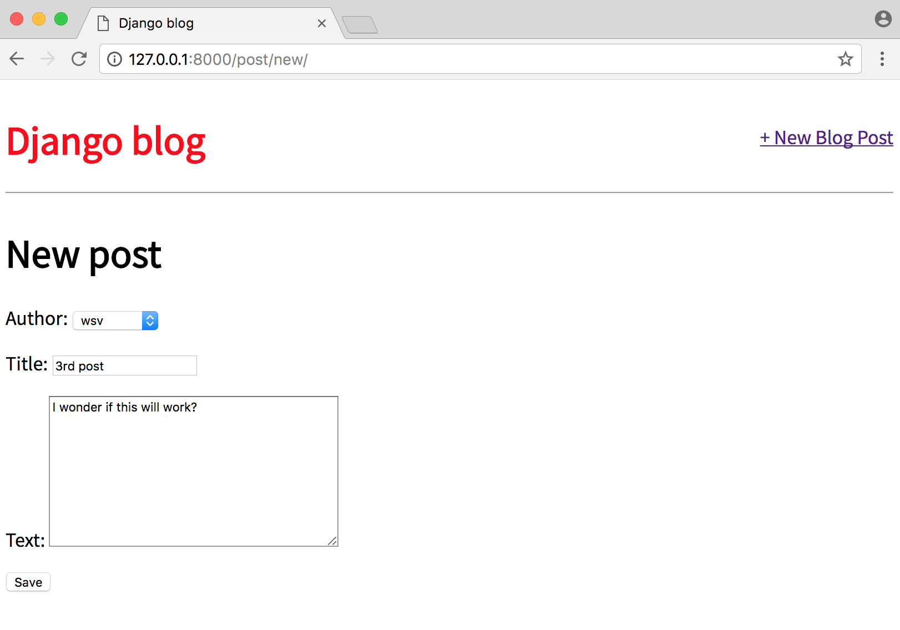
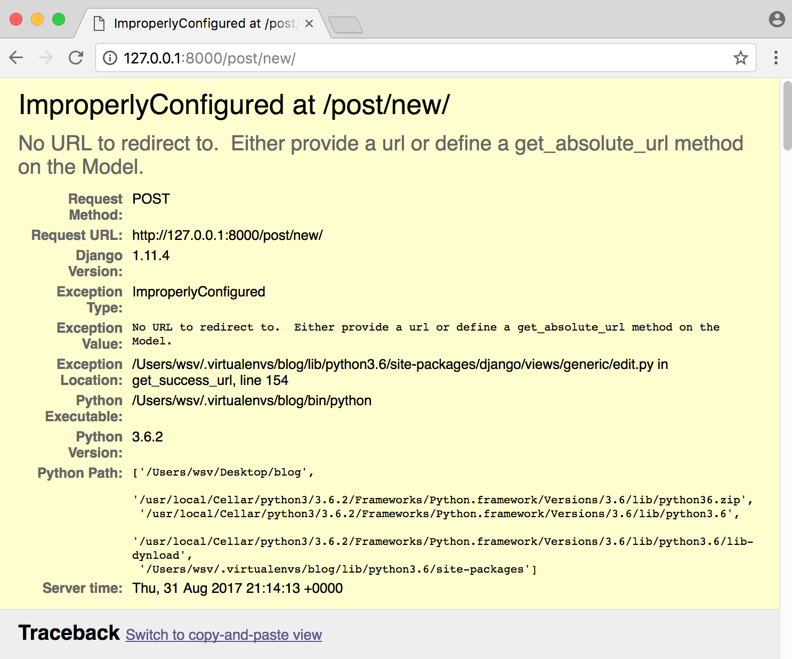
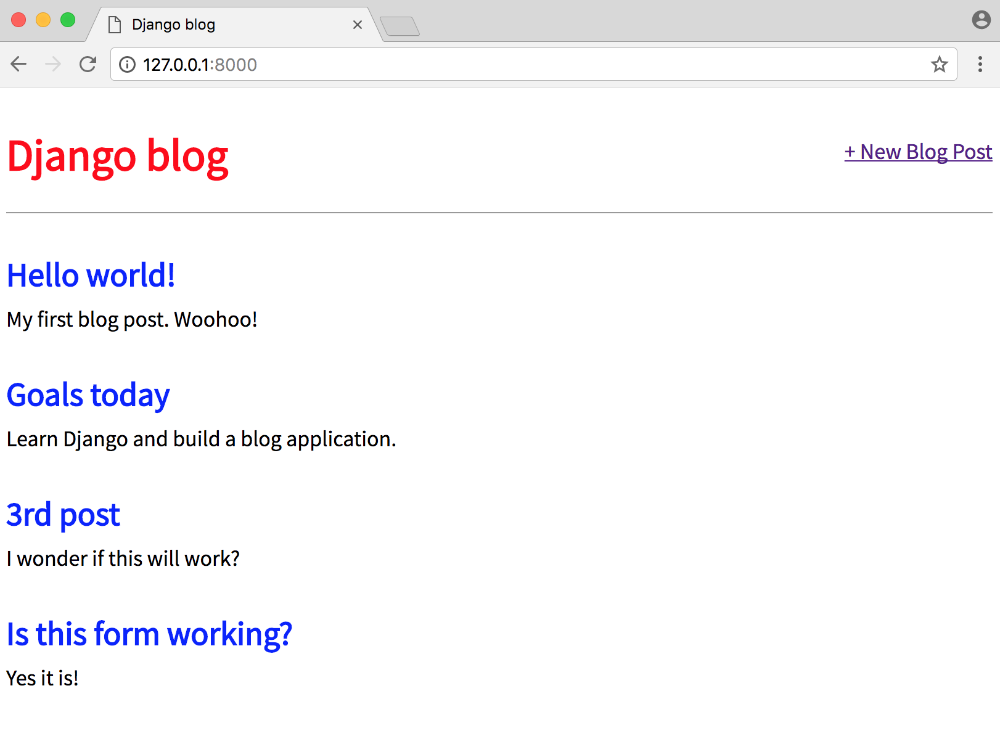
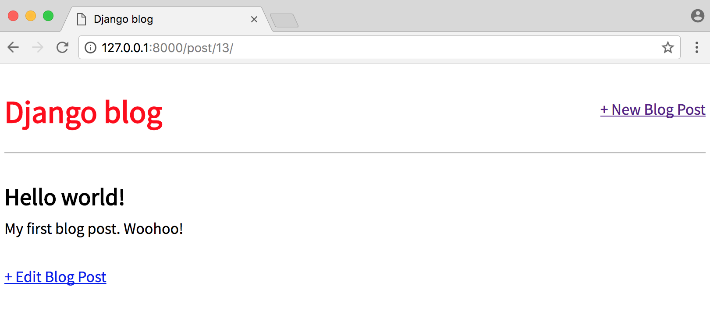
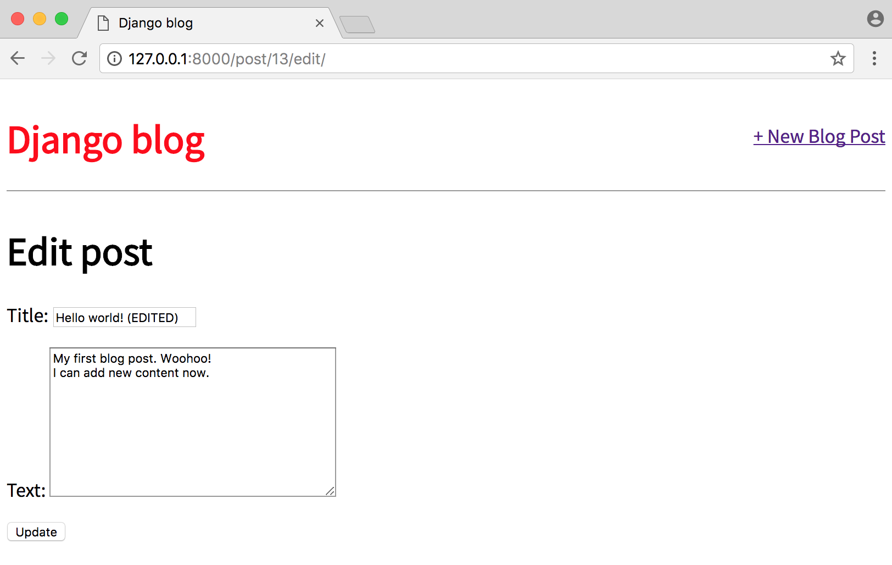
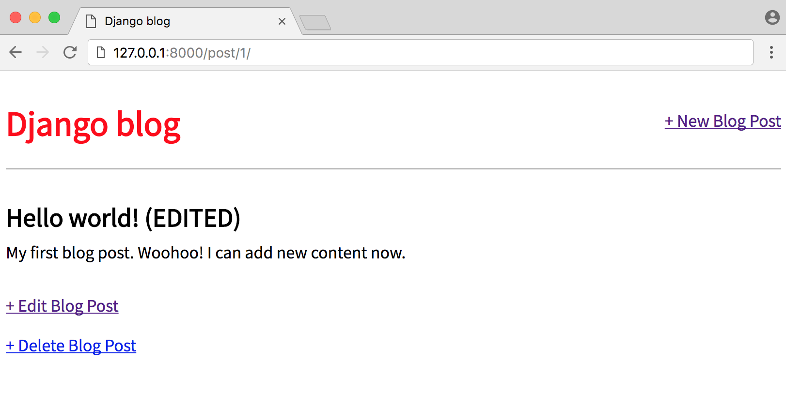

# Chapter 6: Forms

In this chapter we'll continue working on our blog application from **Chapter 5** by adding forms so a user can create, edit, or delete any of their blog entries.

## Forms

Forms are very complicated. Any time you are accepting user input there are security concerns ([XSS Attacks](https://en.wikipedia.org/wiki/Cross-site_scripting)), proper error handling is required, and there are UI considerations around how to alert the user to problems with the form as well as redirects on success.

Fortunately for us [Django Forms](https://docs.djangoproject.com/en/2.0/topics/forms/) abstract away much of the difficulty and provide a rich set of tools to handle common use cases working with forms.

To start, update our base template to display a link to a page for entering new blog posts. It will take the form `` where `post_new` is the name for our URL.

Your updated file will look as follows:

{title="Code",lang="html"}
~~~~~~~~
<!-- templates/base.html -->

<html>
  <head>
    <title>Django blog</title>
    <link href="https://fonts.googleapis.com/css?family=Source+Sans+Pro:400" rel="stylesheet">
    <link rel="stylesheet" href="">
  </head>
  <body>
    

      <header>
        

          <h1><a href="/">Django blog</a></h1>
        

        

          <a href="">+ New Blog Post</a>
        

      </header>
      
      
    

  </body>
</html>
~~~~~~~~

Let's add a new URLConf for `post_new` now:

{title="Code",lang="python"}
~~~~~~~~
# blog/urls.py
from django.urls import path

from . import views

urlpatterns = [
    path('', views.BlogListView.as_view(), name='home'),
    path('post/<int:pk>/', views.BlogDetailView.as_view(), name='post_detail'),
    path('post/new/', views.BlogCreateView.as_view(), name='post_new'),
]
~~~~~~~~

Our url will start with `post/new/`, the view is called `BlogCreateView`, and the url will be named `post_new`. Simple, right?

Now let's create our view by importing a new generic class called `CreateView` and then subclass it to create a new view called `BlogCreateView`.

{title="Code",lang="python"}
~~~~~~~~
# blog/views.py
from django.views.generic import ListView, DetailView
from django.views.generic.edit import CreateView
from . models import Post

class BlogListView(ListView):
    model = Post
    template_name = 'home.html'

class BlogDetailView(DetailView):
    model = Post
    template_name = 'post_detail.html'

class BlogCreateView(CreateView):
    model = Post
    template_name = 'post_new.html'
    fields = '__all__'
~~~~~~~~

Within `BlogCreateView` we specify our database model `Post`, the name of our template `post_new.html`, and all fields with `'__all__'` since we only have two: `title` and `author`.

The last step is to create our template, which we will call `post_new.html`.

{title="Command Line",lang="text"}
~~~~~~~~
(blog) $ touch templates/post_new.html
~~~~~~~~

And then add the following code:

{title="Code",lang="html"}
~~~~~~~~
<!-- templates/post_new.html -->



    <h1>New post</h1>
    <form action="" method="post">
      {{ form.as_p }}
      <input type="submit" value="Save" />
    </form>

~~~~~~~~

Let's breakdown what we've done:

* On the top line we inherit from our base template.
* Use HTML `<form>` tags with the method POST since we're _sending_ data. If we were receiving data from a form, for example in a search box, we would use GET.
* Add a [](https://docs.djangoproject.com/en/2.0/ref/csrf/) which Django provides to protect our form from cross-site scripting attacks. **You should use it for all your Django forms.**
* Then to output our form data we use `{{ form.as_p }}` which renders it within paragraph `
` tags.
* Finally specify an input type of submit and assign it the value "Save"

To view our work, start the server with `python manage.py runserver` and go to the homepage at [http://127.0.0.1:8000/](http://127.0.0.1:8000/).

Click on our link for "+ New Blog Post" which will redirect you to [http://127.0.0.1:8000/post/new/](http://127.0.0.1:8000/post/new/).

Go ahead and try to create a new blog post and submit it.

Oops! What happened?

Django's error message is quite helpful. It's complaining that we did not specify where to send the user after successfully submitting the form. Let's just send a user back to the homepage after success since that will show the list of all their blogs.

We can follow Django's suggestion and add a [get_absolute_url](https://docs.djangoproject.com/en/2.0/ref/models/instances/#django.db.models.Model.get_absolute_url) to our model. This is a best practice that you should always do. It sets a canonical URL for an object so even if the structure of your URLs changes in the future, the reference to the specific object is the same.

Open the `models.py` file. Add a new import on the second line for [reverse](https://docs.djangoproject.com/en/2.0/ref/urlresolvers/#reverse) and a new method `get_absolute_url`.

{title="Command Line",lang="python"}
~~~~~~~~
# blog/models.py
from django.db import models
from django.urls import reverse

class Post(models.Model):
    title = models.CharField(max_length=200)
    author = models.ForeignKey(
        'auth.User',
        on_delete=models.CASCADE,
    )
    body = models.TextField()

    def get_absolute_url(self):
        return reverse('post_detail', args=[str(self.id)])

    def __str__(self):
        return self.title
~~~~~~~~

[Reverse](https://docs.djangoproject.com/en/2.0/ref/urlresolvers/#reverse) is a very handy utility function Django provides us to reference an object by its URL template name, in this case `post_detail`. If you recall our URL pattern it is the following:

{title="Code",lang="python"}
~~~~~~~~
path('post/<int:pk>/', views.BlogDetailView.as_view(), name='post_detail'),
~~~~~~~~

That means in order for this route to work we must _also_ pass in an argument with the `pk` or primary key of the object. Confusingly `pk` and `id` are interchangeable in Django though the Django docs recommend using `self.id` with `get_absolute_url`. In other words, we're telling Django that the ultimate location of a Post entry is its `post_detail` view which is `posts/<int:pk>/` so the route for the first entry we've made will be at `posts/1`.

Try to create a new blog post again at [http://127.0.0.1:8000/post/new/](http://127.0.0.1:8000/post/new/) and you'll find you are redirected to the homepage where the post appears.

You'll also notice that our earlier blog post is also there. It _was_ successfully sent to the database, but Django didn't know how to redirect us after that.

While we could go into the Django admin to delete unwanted posts, it's better if we add forms so a user can update and delete existing forms directly from the site.

## Update Form

The process for creating an update form so users can edit blog posts should feel familiar. We'll again use a built-in Django class-based generic view, [UpdateView](https://docs.djangoproject.com/en/2.0/ref/class-based-views/generic-editing/#django.views.generic.edit.UpdateView), and create the requisite template, url, and view.

To start, let's add a new link to `post_detail.html` so that the option to edit a blog post appears on an individual blog page.

{title="Code",lang="html"}
~~~~~~~~
<!-- templates/post_detail.html -->



  

    <h2>{{ object.title }}</h2>
    
{{ object.body }}

  

  <a href="">+ Edit Blog Post</a>

~~~~~~~~

We've added a link using `<a href>...</a>` and the Django template engine's `` tag. Within it we've specified the target name of our url, which will be called `post_edit` and also passed the parameter needed, which is the primary key of the post `post.pk`.

Next we create the template for our edit page called `post_edit.html`.

{title="Command Line",lang="text"}
~~~~~~~~
(blog) $ touch templates/post_edit.html
~~~~~~~~

And add the following code:

{title="Code",lang="html"}
~~~~~~~~
<!-- templates/post_edit.html -->



    <h1>Edit post</h1>
    <form action="" method="post">
      {{ form.as_p }}
    <input type="submit" value="Update" />
</form>

~~~~~~~~

We again use HTML `<form></form>` tags, Django's `csrf_token` for security, `form.as_p` to display our form fields with paragraph tags, and finally give it the value "Update" on the submit button.

Now to our view. We need to import `UpdateView` on the second-from-the-top line and then subclass it in our new view `BlogUpdateView`.

{title="Code",lang="python"}
~~~~~~~~
# blog/views.py
from django.views.generic import ListView, DetailView
from django.views.generic.edit import CreateView, UpdateView
from . models import Post

class BlogListView(ListView):
    model = Post
    template_name = 'home.html'

class BlogDetailView(DetailView):
    model = Post
    template_name = 'post_detail.html'

class BlogCreateView(CreateView):
    model = Post
    template_name = 'post_new.html'
    fields = '__all__'

class BlogUpdateView(UpdateView):
    model = Post
    fields = ['title', 'body']
    template_name = 'post_edit.html'
~~~~~~~~

Notice that in `BlogUpdateView` we are explicitly listing the fields we want to use `['title', 'body']` rather than using `'__all__'`. This is because we assume that the author of the post is not changing; we only want the title and text to be editable.

The final step is to update our `urls.py` file as follows:

{title="Code",lang="python"}
~~~~~~~~
# blog/urls.py
from django.urls import path

from . import views

urlpatterns = [
    path('', views.BlogListView.as_view(), name='home'),
    path('post/<int:pk>/', views.BlogDetailView.as_view(), name='post_detail'),
    path('post/new/', views.BlogCreateView.as_view(), name='post_new'),
    path('post/<int:pk>/edit/',
        views.BlogUpdateView.as_view(), name='post_edit'),
]
~~~~~~~~

At the top we add our view `BlogUpdateView` to the list of imported views, then created a new url pattern for `/post/pk/edit` and given it the name `post_edit`.

Now if you click on a blog entry you'll see our new Edit button.

If you click on "+ Edit Blog Post" you'll be redirected to [http://127.0.0.1:8000/post/1/edit/](http://127.0.0.1:8000/post/13/edit/) if it's your first blog post.

Note that the form is pre-filled with our database's existing data for the post. Let's make a change...

And after clicking the "Update" button we are redirected to the detailview of the post where you can see the change. This is because of our `get_absolute_url` setting. Navigate to the homepage and you can see the change next to all the other entries.

## Delete View

The process for creating a form to delete blog posts is very similar to that for updating a post. We'll use a generic class-based view, [DeleteView](https://docs.djangoproject.com/en/2.0/ref/class-based-views/generic-editing/#deleteview), to help and need to create a view, url, and template for the functionality.

Let's start by adding a link to delete blog posts on our individual blog page, `post_detail.html`.

{title="Code",lang="html"}
~~~~~~~~
<!-- templates/post_detail.html -->



  

    <h2>{{ object.title }}</h2>
    
{{ object.body }}

  

  
<a href="">+ Edit Blog Post</a>

  
<a href="">+ Delete Blog Post</a>


~~~~~~~~

Then create a new file for our delete page template. First quit the local server `Control-c` and then type the following command:

{title="Command Line",lang="text"}
~~~~~~~~
(blog) $ touch templates/post_delete.html
~~~~~~~~

And fill it with this code:

{title="Code",lang="html"}
~~~~~~~~
<!-- templates/post_delete.html -->



    <h1>Delete post</h1>
    <form action="" method="post">
      
Are you sure you want to delete "{{ post.title }}"?

      <input type="submit" value="Confirm" />
    </form>

~~~~~~~~

Note we are using `post.title` here to display the title of our blog post. We could also just use `object` as it too is provided by `DetailView`.

Now update our `views.py` file, by importing `DeleteView` and `reverse_lazy` at the top, then create a new view that subclasses `DeleteView`.

{title="Code",lang="python"}
~~~~~~~~
# blog/views.py
from django.views.generic import ListView, DetailView
from django.views.generic.edit import CreateView, UpdateView, DeleteView
from django.urls import reverse_lazy

from . models import Post

class BlogListView(ListView):
    model = Post
    template_name = 'home.html'

class BlogDetailView(DetailView):
    model = Post
    template_name = 'post_detail.html'

class BlogCreateView(CreateView):
    model = Post
    template_name = 'post_new.html'
    fields = '__all__'

class BlogUpdateView(UpdateView):
    model = Post
    fields = ['title', 'body']
    template_name = 'post_edit.html'

class BlogDeleteView(DeleteView):
    model = Post
    template_name = 'post_delete.html'
    success_url = reverse_lazy('home')
~~~~~~~~

We use [reverse_lazy](https://docs.djangoproject.com/en/2.0/ref/urlresolvers/#reverse-lazy) as opposed to just [reverse](https://docs.djangoproject.com/en/2.0/ref/urlresolvers/#reverse) so that it won't execute the URL redirect until our view has finished deleting the blog post.

Finally add a url by importing our view `BlogDeleteView` and adding a new pattern:

{title="Code",lang="python"}
~~~~~~~~
# blog/urls.py
from django.urls import path

from . import views

urlpatterns = [
    path('', views.BlogListView.as_view(), name='home'),
    path('post/<int:pk>/', views.BlogDetailView.as_view(), name='post_detail'),
    path('post/new/', views.BlogCreateView.as_view(), name='post_new'),
    path('post/<int:pk>/edit/',
        views.BlogUpdateView.as_view(), name='post_edit'),
    path('post/<int:pk>/delete/',
        views.BlogDeleteView.as_view(), name='post_delete'),
]
~~~~~~~~

If you start the server again `python manage.py runserver` and refresh the individual post page you'll see our "Delete Blog Post" link.

Clicking on the link takes us to the delete page for the blog post, which displays the name of the blog post.

If you click on the "Confirm" button, it redirects you to the homepage where the blog post has been deleted!

So it works!

## Tests

Time for tests to make sure everything works now--and in the future--as expected. We've added a `get_absolute_url` method to our model and new views for create, update, and edit posts. That means we need four new tests:

* `def test_get_absolute_url`
* `def test_post_create_view`
* `def test_post_update_view`
* `def test_post_delete_view`

Update your existing `tests.py` as follows.

{title="Code",lang="python"}
~~~~~~~~
# blog/tests.py
from django.contrib.auth import get_user_model
from django.test import Client, TestCase
from django.urls import reverse

from .models import Post

class BlogTests(TestCase):

    def setUp(self):
        self.user = get_user_model().objects.create_user(
            username='testuser',
            email='test@email.com',
            password='secret'
        )

        self.post = Post.objects.create(
            title='A good title',
            body='Nice body content',
            author=self.user,
        )

    def test_string_representation(self):
        post = Post(title='A sample title')
        self.assertEqual(str(post), post.title)

    def test_get_absolute_url(self):
        self.assertEquals(self.post.get_absolute_url(), '/post/1/')

    def test_post_content(self):
        self.assertEqual(f'{self.post.title}', 'A good title')
        self.assertEqual(f'{self.post.author}', 'testuser')
        self.assertEqual(f'{self.post.body}', 'Nice body content')

    def test_post_list_view(self):
        response = self.client.get(reverse('home'))
        self.assertEqual(response.status_code, 200)
        self.assertContains(response, 'Nice body content')
        self.assertTemplateUsed(response, 'home.html')

    def test_post_detail_view(self):
        response = self.client.get('/post/1/')
        no_response = self.client.get('/post/100000/')
        self.assertEqual(response.status_code, 200)
        self.assertEqual(no_response.status_code, 404)
        self.assertContains(response, 'A good title')
        self.assertTemplateUsed(response, 'post_detail.html')

    def test_post_create_view(self):
        response = self.client.post(reverse('post_new'), {
            'title': 'New title',
            'body': 'New text',
            'author': self.user,
        })
        self.assertEqual(response.status_code, 200)
        self.assertContains(response, 'New title')
        self.assertContains(response, 'New text')

    def test_post_update_view(self):
        response = self.client.post(reverse('post_edit', args='1'), {
            'title': 'Updated title',
            'body': 'Updated text',
        })
        self.assertEqual(response.status_code, 302)

    def test_post_delete_view(self):
        response = self.client.get(
            reverse('post_delete', args='1'))
        self.assertEqual(response.status_code, 200)
~~~~~~~~

We expect the url of our test to be at `post/1/` since there's only one post and the `1` is its primary key Django adds automatically for us. To test create view we make a new response and then ensure that the response goes through (status code 200) and contains our new title and body text. For update view we access the first post--which has a `pk` of `1` which is passed in as the only argument--and we confirm that it results in a 302 redirect. Finally we test our delete view by confirming that if we delete a post the status code is 200 for success.

There's always more tests that can be added but this at least has coverage on all our new functionality.

## Conclusion

In a small amount of code we've built a blog application that allows for creating, reading, updating, and deleting blog posts. This core functionality is know by the acronym [CRUD](https://en.wikipedia.org/wiki/Create,_read,_update_and_delete). While there are multiple ways to achieve this same functionality--we could have used function-based views or written our own class-based views--we've demonstrated how little code it takes in Django to make this happen.

In the next chapter we'll add user accounts and login, logout, and signup functionality.

Continue on to **Chapter 7: Blog app with user accounts**.
