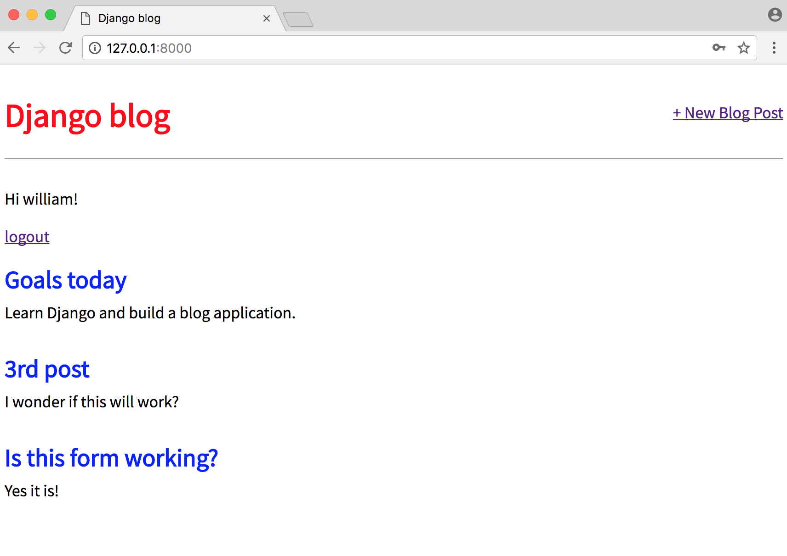

# Chapter 7: Blog app with user accounts

So far we've built a working blog application that uses forms, but we're missing a major piece of most web applications: user authentication.

Implementing proper user authentication is famously hard; there are many security gotchas along the way so you really don't want to implement this yourself. Fortunately Django comes with a powerful, built-in [user authentication system](https://docs.djangoproject.com/en/2.0/topics/auth/) that we can use.

Whenever you create a new project, by default Django installs the `auth` app, which provides us with a [User object](https://docs.djangoproject.com/en/2.0/ref/contrib/auth/#django.contrib.auth.models.User) containing:

* username
* password
* email
* first_name
* last_name

We will use this `User` object to implement login, logout, and signup in our blog application.

## Login

Django provides us with a default view for a login page via [LoginView](https://docs.djangoproject.com/en/2.0/topics/auth/default/#django.contrib.auth.views.LoginView). All we need to add are a project-level urlpattern for the auth system, a login template, and a small update to our `settings.py` file.

First update the project-level `urls.py` file. We'll place our login and logout pages at the `accounts/` URL. This is a one-line addition on the next-to-last line.

{title="Code",lang="python"}
~~~~~~~~
# blog_project/urls.py
from django.contrib import admin
from django.urls import path, include

urlpatterns = [
    path('admin/', admin.site.urls),
    path('accounts/', include('django.contrib.auth.urls')),
    path('', include('blog.urls')),
]
~~~~~~~~

As the [LoginView](https://docs.djangoproject.com/en/2.0/topics/auth/default/#django.contrib.auth.views.LoginView) documentation notes, by default Django will look within a templates folder called `registration` for a file called `login.html` for a login form. So we need to create a new directory called `registration` and the requisite file within it. From the command line type `Control-C` to quit our local server. Then enter the following:

{title="Command Line",lang="text"}
~~~~~~~~
(blog) $ mkdir templates/registration
(blog) $ touch templates/registration/login.html
~~~~~~~~

Now type the following template code for our newly-created file.

{title="Code",lang="html"}
~~~~~~~~
<!-- templates/registration/login.html -->



<h2>Login</h2>
<form method="post">
  
  {{ form.as_p }}
  <button type="submit">Login</button>
</form>

~~~~~~~~

We're using HTML `<form></form>` tags and specifying the POST method since we're sending data to the server (we'd use GET if we were requesting data, such as in a search engine form). We add `` for security concerns, namely to prevent a XSS Attack. The form's contents are outputted between paragraph tags thanks to `{{ form.as_p }}` and then we add a "submit" button.

The final step is we need to specify _where_ to redirect the user upon a successful login. We can set this with the `LOGIN_REDIRECT_URL` setting. At the bottom of the `settings.py` file add the following:

{title="Code",lang="python"}
~~~~~~~~
# settings.py
LOGIN_REDIRECT_URL = 'home'
~~~~~~~~

Now the user will be redirected to the `'home'` template which is our homepage.

**We're actually done at this point!** If you now start up the Django server again with `python manage.py runserver` and navigate to our login page at [http://127.0.0.1:8000/accounts/login/](http://127.0.0.1:8000/accounts/login/) you'll see the following.

Upon entering the login info for our superuser account, we are redirected to the homepage. Notice that we didn't add any _view_ logic or create a database model because the Django auth system provided both for us automatically. Thanks Django!

## Updated homepage

Let's update our `base.html` template so we display a message to users whether they are logged in or not. We can use the [is_authenticated](https://docs.djangoproject.com/en/2.0/ref/contrib/auth/#django.contrib.auth.models.User.is_authenticated) attribute for this.

For now, we can simply place this code in a prominent position. Later on we can style it more appropriately. Update the `base.html` file with new code starting beneath the closing `</header>` tag.

{title="Code",lang="html"}
~~~~~~~~
<!-- templates/base.html -->
...
</header>

  
Hi {{ user.username }}!


  
You are not logged in.

  <a href="">login</a>



~~~~~~~~

If the user is logged in we say hello to them by name, if not we provide a link to our newly created login page.

It worked! My superuser name is `wsv` so that's what I see on the page.

## Logout link

We added template page logic for logged out users but...how do we log out now? We could go into the Admin panel and do it manually, but there's a better way. Let's add a logout link instead that redirects to the homepage. Thanks to the Django auth system, this is dead-simple to achieve.

In our `base.html` file add a one-line link for logging out.

{title="Command Line",lang="html"}
~~~~~~~~
<!-- templates/base.html-->
...

  
Hi {{ user.username }}!

  
<a href="">logout</a>


...
~~~~~~~~

That's all we need to do as the necessary _view_ is provided to us by the Django `auth` app. We do need to specify where to redirect a user upon logout though.

Update `settings.py` to provide a redirect link which is called, appropriately, `LOGOUT_REDIRECT_URL`. We can add it right next to our login redirect so the bottom of the file should look as follows:

{title="Code",lang="python"}
~~~~~~~~
# blog_project/settings.py
LOGIN_REDIRECT_URL = 'home'
LOGOUT_REDIRECT_URL = 'home'
~~~~~~~~

If you refresh the homepage you'll see it now has a "logout" link for logged in users.

And clicking it takes you back to the homepage with a "login" link.

Go ahead and try logging in and out several times with your user account.

## Signup

We need to write our own view for a signup page to register new users, but Django provides us with a form class, [UserCreationForm](https://docs.djangoproject.com/en/2.0/topics/auth/default/#django.contrib.auth.forms.UserCreationForm), to make things easier. By default it comes with three fields: `username`, `password1`, and `password2`.

There are many ways to organize your code and url structure for a robust user authentication system. Here we will create a dedicated new app, `accounts`, for our signup page.

{title="Command Line",lang="text"}
~~~~~~~~
(blog) $ python manage.py startapp accounts
~~~~~~~~

Add the new app to the `INSTALLED_APPS` setting in our `settings.py` file.

{title="Code",lang="python"}
~~~~~~~~
# blog_project/settings.py
INSTALLED_APPS = [
    'django.contrib.admin',
    'django.contrib.auth',
    'django.contrib.contenttypes',
    'django.contrib.sessions',
    'django.contrib.messages',
    'django.contrib.staticfiles',
    'blog',
    'accounts',
]
~~~~~~~~

Next add a project-level `url` pointing to this new app directly **below** where we include the built-in `auth` app.

{title="Code",lang="python"}
~~~~~~~~
# blog_project/urls.py
from django.contrib import admin
from django.urls import path, include

urlpatterns = [
    path('admin/', admin.site.urls),
    path('accounts/', include('django.contrib.auth.urls')),
    path('accounts/', include('accounts.urls')),
    path('', include('blog.urls')),
]
~~~~~~~~

The order of our `urls` matters here because Django reads this file top-to-bottom. Therefore when we request a `/accounts/signup` url, Django will first look in `auth`, not find it, and **then** proceed to the `accounts` app.

Let's go ahead and create our `accounts/urls.py` file.

{title="Command Line",lang="text"}
~~~~~~~~
(blog) $ touch accounts/urls.py
~~~~~~~~

And add the following code:

{title="Code",lang="python"}
~~~~~~~~
# acounts/urls.py
from django.urls import path

from . import views

urlpatterns = [
    path('signup/', views.SignUpView.as_view(), name='signup'),
]
~~~~~~~~

We're using a not-yet-created view called `SignupView` which we already know is class-based since it is capitalized and has the `as_view()` suffix. Its path is just `signup/` so the overall path will be `accounts/signup/`.

Now for the view which uses the built-in `UserCreationForm` and generic `CreateView`.

{title="Code",lang="python"}
~~~~~~~~
# accounts/views.py
from django.contrib.auth.forms import UserCreationForm
from django.urls import reverse_lazy
from django.views import generic

class SignUpView(generic.CreateView):
    form_class = UserCreationForm
    success_url = reverse_lazy('login')
    template_name = 'signup.html'
~~~~~~~~

We’re subclassing the generic class-based view `CreateView` in our `SignUpView` class. We specify the use of the built-in `UserCreationForm` and the not-yet-created template at `signup.html`. And we use `reverse_lazy` to redirect the user to the login page upon successful registration.

Why use `reverse_lazy` here instead of `reverse`? The reason is that for all generic class-based views the urls are not loaded when the file is imported, so we have to use the lazy form of `reverse` to load them later when they’re available.

Now let's add `signup.html` to our project-level `templates` folder:

{title="Command Line",lang="text"}
~~~~~~~~
(blog) $ touch templates/signup.html
~~~~~~~~

Add then populate it with the code below.

{title="Code",lang="html"}
~~~~~~~~
<!-- templates/signup.html -->



<h2>Sign up</h2>
<form method="post">
  
  {{ form.as_p }}
  <button type="submit">Sign up</button>
</form>

~~~~~~~~

This format is very similar to what we've done before. We extend our base template at the top, place our logic between `<form></form>` tags, use the `csrf_token` for security, display the form's content in paragraph tags with `form.as_p`, and include a submit button.

We're now done! To test it out, navigate to our newly created page [http://127.0.0.1:8000/accounts/signup/](http://127.0.0.1:8000/accounts/signup/).

Notice there is a lot of extra text that Django includes by default. We can customize this using something like the built-in [messages framework](https://docs.djangoproject.com/en/2.0/ref/contrib/messages/) but for now try out the form.

I've created a new user called "william" and upon submission was redirected to the login page. Then after logging in successfully with my new user and password, I was redirected to the homepage with our personalized "Hi username" greeting.

Our ultimate flow is therefore: `Signup -> Login -> Homepage`. And of course we can tweak this however we want. The `SignupView` redirects to `login` because we set `success_url = reverse_lazy('login')`. The `Login` page redirects to the homepage because in our `settings.py` file we set `LOGIN_REDIRECT_URL = 'home'`.

It can seem overwhelming at first to keep track of all the various parts of a Django project. That's normal. But I promise with time they'll start to make more sense.

## Bitbucket

It's been a while since we made a `git` commit. Let's do that and then push a copy of our code onto Bitbucket.

First check all the new work that we've done with `git status`.

{title="Command Line",lang="text"}
~~~~~~~~
(blog) $ git status
~~~~~~~~

Then add the new content.

{title="Command Line",lang="text"}
~~~~~~~~
(blog) $ git commit -m 'forms and user accounts'
~~~~~~~~

[Create a new repo](https://bitbucket.org/repo/create) on Bitbucket which you can call anything you like. I'll choose the name `blog-app`. Therefore _after creating the new repo on the Bitbucket site_ I can type the following two commands. Make sure to replace my username `wsvincent` with yours from Bitbucket.

{title="Command Line",lang="text"}
~~~~~~~~
(blog) $ git remote add origin git@bitbucket.org:wsvincent/blog-app.git
(blog) $ git push -u origin master
~~~~~~~~

All done! Now we can deploy our new app on Heroku.

## Heroku config

This is our third time deploying an app. As with our _message board_ app, there are four changes we need to make so it can be deployed on Heroku.

* update `Pipfile.lock`
* new `Procfile`
* install `gunicorn`
* update `settings.py`

We'll specify a Python version in our `Pipfile` and then run `pipenv lock` to apply it to the `Pipfile.lock`. We'll add a `Procfile` which is a Heroku-specific configuration file, install `gunicorn` to run as our production web server in place of Django's local server, and finally update the `ALLOWED_HOSTS` so anyone can view our app.

Open the `Pipfile` with your text editor and at the bottom add the following two lines.

{title="Code",lang="text"}
~~~~~~~~
# Pipfile
[requires]
python_version = "3.6"
~~~~~~~~

We're using `3.6` here rather than the more specific `3.6.4` so that our app is automatically updated to the most recent version of Python 3.6x on Heroku.

Now run `pipenv lock` to update our `Pipfile.lock` since Heroku will use it to generate a new environment on Heroku servers for our app.

{title="Command Line",lang="text"}
~~~~~~~~
(blog) $ pipenv lock
~~~~~~~~

Create a new `Procfile` file.

{title="Command Line",lang="text"}
~~~~~~~~
(blog) $ touch Procfile
~~~~~~~~

Within your text editor add the following line to `Procfile`. This tells tells Heroku to use `gunicorn` rather than the local server which is not suitable for production.

{title="Code",lang="text"}
~~~~~~~~
web: gunicorn blog_project.wsgi --log-file -
~~~~~~~~

Now install [gunicorn](http://gunicorn.org/).

{title="Command Line",lang="text"}
~~~~~~~~
(blog) $ pipenv install gunicorn
~~~~~~~~

Finally update `ALLOWED_HOSTS` to accept all domains, which is represented by the asterisk `*`.

{title="Code",lang="python"}
~~~~~~~~
# blog_project/settings.py
ALLOWED_HOSTS = ['*']
~~~~~~~~

We can commit our new changes and push them up to Bitbucket.

{title="Command Line",lang="text"}
~~~~~~~~
(blog) $ git status
(blog) $ git add -A
(blog) $ git commit -m 'Heroku config files and updates'
(blog) $ git push -u origin master
~~~~~~~~

## Heroku deployment

To deploy on Heroku first confirm that you're logged in to your existing Heroku account.

{title="Command Line",lang="text"}
~~~~~~~~
(blog) $ heroku login
~~~~~~~~

Then run the `create` command which tells Heroku to make a new container for our app to live in. If you just run `heroku create` then Heroku will assign you a random name, however you can specify a custom name but it must be _unique on Heroku_. In other words, since I'm picking the name `dfb-blog` you can't. You need some other combination of letters and numbers.

{title="Command Line",lang="text"}
~~~~~~~~
(blog) $ heroku create dfb-blog
~~~~~~~~

Now configure `git` so that when you push to Heroku, it goes to your new app name (replacing `dfb-blog` with your custom name).

{title="Command Line",lang="text"}
~~~~~~~~
(blog) $ heroku git:remote -a dfb-blog
~~~~~~~~

There's one more step we need to take now that we have static files, which in our case is CSS. Django does not support serving static files in production however the [WhiteNoise](http://whitenoise.evans.io/en/stable/) project does. So let's install it.

{title="Command Line",lang="text"}
~~~~~~~~
(blog) $ pipenv install whitenoise
~~~~~~~~

Then we need to update our static settings so it will be used in production. In your text editor open `settings.py`. Add whitenoise to the `INSTALLED_APPS` **above** the built-in staticfiles app and also to `MIDDLEWARE` on the third line. Order matters for both `INSTALLED_APPS` and `MIDDLEWARE`.

At the bottom of the file add new lines for both `STATIC_ROOT` and `STATICFILES_STORAGE`. It should look like the following.

{title="Code",lang="python"}
~~~~~~~~
# blog_project/settings.py
INSTALLED_APPS = [
    'django.contrib.admin',
    'django.contrib.auth',
    'django.contrib.contenttypes',
    'django.contrib.sessions',
    'django.contrib.messages',
    'whitenoise.runserver_nostatic', # new!
    'django.contrib.staticfiles',
    'blog',
]

MIDDLEWARE = [
    'django.middleware.security.SecurityMiddleware',
    'django.contrib.sessions.middleware.SessionMiddleware',
    'whitenoise.middleware.WhiteNoiseMiddleware', # new!
    'django.middleware.common.CommonMiddleware',
    'django.middleware.csrf.CsrfViewMiddleware',
    'django.contrib.auth.middleware.AuthenticationMiddleware',
    'django.contrib.messages.middleware.MessageMiddleware',
    'django.middleware.clickjacking.XFrameOptionsMiddleware',
]

...

STATIC_ROOT = os.path.join(BASE_DIR, 'staticfiles') # new!
STATIC_URL = '/static/'
STATICFILES_DIRS = [os.path.join(BASE_DIR, 'static')]
STATICFILES_STORAGE = 'whitenoise.storage.CompressedManifestStaticFilesStorage' # new!
~~~~~~~~

Make sure to add and commit your new changes. Then push it to Bitbucket.

{title="Command Line",lang="text"}
~~~~~~~~
(blog) $ git add -A
(blog) $ git commit -m 'Heroku config'
(blog) $ git push origin master
~~~~~~~~

Finally we can push our code to Heroku.

{title="Command Line",lang="text"}
~~~~~~~~
(blog) $ git push heroku master
~~~~~~~~

The URL of your new app will be in the command line output or you can run `heroku open` to find it. Mine is located at [https://dfb-blog.herokuapp.com/](https://dfb-blog.herokuapp.com/).

## Conclusion

With very little code, the Django framework has allowed us to create a login, logout, and signup user authentication flow. And under-the-hood it has taken care of the many security gotchas that can crop up if you try to create your own user authentication flow from scratch.

We could improve this blog by adding the "signup" link in the top nav. Perhaps even having some template logic so logged out users see "signup" but logged in users only see "logout". We'll implement this and more in the next few chapters as we start our final project of the book: a _social messaging_ app.

Continue on to **Chapter 8: Custom User Accounts**.
